# AI-Powered Claim Denial Prevention & Remediation System

## Comprehensive Architecture & Implementation Document

> **Standard:** Production-grade, HIPAA-compliant, corporate-quality technical specification  
> **Format:** Problem → Solution → Implementation  
> **Date:** 2026-04-16  
> **Author:** Krish Koria

---

## Table of Contents

1. [Executive Summary](#1-executive-summary)
2. [Problem Statement](#2-problem-statement)
3. [Solution Overview](#3-solution-overview)
4. [User Personas & Use Cases](#4-user-personas--use-cases)
5. [Test Cases by User Type](#5-test-cases-by-user-type)
6. [Functional Requirements](#6-functional-requirements)
7. [Non-Functional Requirements](#7-non-functional-requirements)
8. [Assumptions & Constraints](#8-assumptions--constraints)
9. [Dataset Analysis](#9-dataset-analysis)
10. [Technology Stack with Rationale](#10-technology-stack-with-rationale)
11. [System Architecture (High-Level)](#11-system-architecture-high-level)
12. [Data Architecture — Medallion](#12-data-architecture--medallion)
13. [ML/AI Architecture](#13-mlai-architecture)
14. [RAG Architecture](#14-rag-architecture)
15. [Agent Architecture](#15-agent-architecture)
16. [API Architecture](#16-api-architecture)
17. [Frontend Architecture](#17-frontend-architecture)
18. [Security Architecture](#18-security-architecture)
19. [HIPAA Compliance Framework](#19-hipaa-compliance-framework)
20. [Identity & Authorization Flow](#20-identity--authorization-flow)
21. [Deployment](#21-deployment)
22. [Exception Handling Strategy](#22-exception-handling-strategy)
23. [HIPAA Audit Logging](#23-hipaa-audit-logging)
24. [Cost Estimation](#24-cost-estimation)
25. [Testing Strategy](#25-testing-strategy)
26. [Development Roadmap — 8 Weeks](#26-development-roadmap--8-weeks)

---

## 1. Executive Summary

Healthcare organizations lose an estimated **$262 billion annually** due to denied insurance claims. The majority of these denials (up to 67%) are preventable — caused by missing documentation, incorrect code mappings, billing anomalies, and data quality issues that could be caught before submission.

This system is an **AI-powered, HIPAA-aligned, production-style claim risk scoring, validation, and remediation platform** that:

- **Scores** pre-submission denial risk using deterministic validation rules plus a proxy-label ML model
- **Explains** the specific reasons a claim is at risk, backed by policy documents via RAG
- **Recommends** precise, actionable fixes via an intelligent orchestration layer
- **Operates** on a Medallion data architecture (Bronze/Silver/Gold) on Databricks, with cloud-agnostic deployment patterns for HIPAA-eligible managed environments

The platform serves as a **pre-submission quality gate** — shifting denial prevention from reactive (after denial) to proactive (before submission).

**Important v1 scope note:** the current project dataset does not contain real insurer adjudication outcomes. Therefore, v1 is positioned as a **claim-risk scoring and validation system**, not as a statistically proven payer-outcome prediction platform. The architecture is intentionally designed so that true denial prediction can be added later once real outcome labels are available.

---

## 2. Problem Statement

### 2.1 Business Context

In the current healthcare billing workflow:

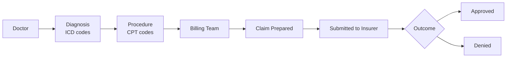

When a claim is **denied**, the process becomes:

- Manual review by billing staff (costly, time-consuming)
- Appeal filing (30–90 day turnaround)
- Revenue loss if appeal fails or isn't filed in time
- Administrative burden averaging **$14 per claim** to rework

### 2.2 Root Causes of Denial (Validated by Dataset)

From analysis of the `claims_1000.csv` dataset, the following issues are directly observable:

| Root Cause                          | Example from Dataset                            | Business Impact                     |
| ----------------------------------- | ----------------------------------------------- | ----------------------------------- |
| Missing `procedure_code`            | C0001: no procedure_code                        | Automatic denial — incomplete claim |
| Missing `billed_amount`             | C0001, C0003: no billed_amount                  | Unprocessable claim                 |
| Overbilling vs benchmark            | billed_amount >> expected_cost                  | Fraud flag, denial                  |
| Provider-diagnosis mismatch         | Cardiology provider billing for Bone (D20)      | Medical necessity denial            |
| Missing provider location           | PR101: no location                              | Administrative rejection            |
| Diagnosis-procedure incompatibility | High-severity diagnosis with low-cost procedure | Clinical review denial              |

### 2.3 Current State Problems

1. **No pre-submission validation** — claims are submitted "blind"
2. **No ML-based risk scoring** — denials only discovered post-submission
3. **No policy-backed explanations** — billing staff don't know _which_ rule was violated
4. **No actionable remediation** — staff manually research fixes
5. **No audit trail** — no record of what was checked and when (HIPAA risk)

### 2.4 Impact Quantification

| Metric                        | Before System    | After System (Target)               |
| ----------------------------- | ---------------- | ----------------------------------- |
| Denial rate                   | 15–20% of claims | <5% of claims                       |
| Rework cost per claim         | $14              | $2 (automated fix suggestion)       |
| Time to identify denial cause | 2–5 hours        | <30 seconds                         |
| Appeal success rate           | 45%              | >75% (policy-backed appeal letters) |

---

## 3. Solution Overview

### 3.1 The "How" — System Philosophy

The system is designed as a **pre-submission intelligence layer** that intercepts every claim before it reaches the insurer. It asks three questions:

1. **How risky is this claim before submission?** (rules + proxy-label ML risk score)
2. **Why is it risky?** (rule flags + SHAP feature contributions + policy retrieval)
3. **How do we fix it before submission?** (agent-generated remediation plan)

### 3.2 Architecture Philosophy

**Why Medallion + Databricks?**
The claim data pipeline must handle:

- Raw data with intentional anomalies (missing fields, incorrect codes, outlier amounts)
- Incremental ingestion (new claims arrive daily)
- HIPAA audit requirements (every data transformation must be logged and reversible)
- ML feature engineering at scale

The Medallion Architecture (Bronze → Silver → Gold) provides a **principled data quality contract**: raw data is preserved (Bronze), cleaned data is standardized (Silver), and business-ready features are computed (Gold). Delta Lake provides ACID transactions — no partial writes, no silent data corruption, full time-travel for HIPAA audit.

**Why cloud-agnostic?**
The final cloud provider is not yet decided. All application services are containerized with Docker, and Databricks is available natively on AWS, GCP, and Azure. "Cloud-agnostic" in this document means the application code and logical architecture remain stable across Databricks-supported clouds; only the networking and infrastructure implementation details change per provider.

Managed services are explicitly in scope, provided they support the required compliance controls, BAAs, encryption, logging, and private connectivity patterns.

### 3.3 Solution Flow

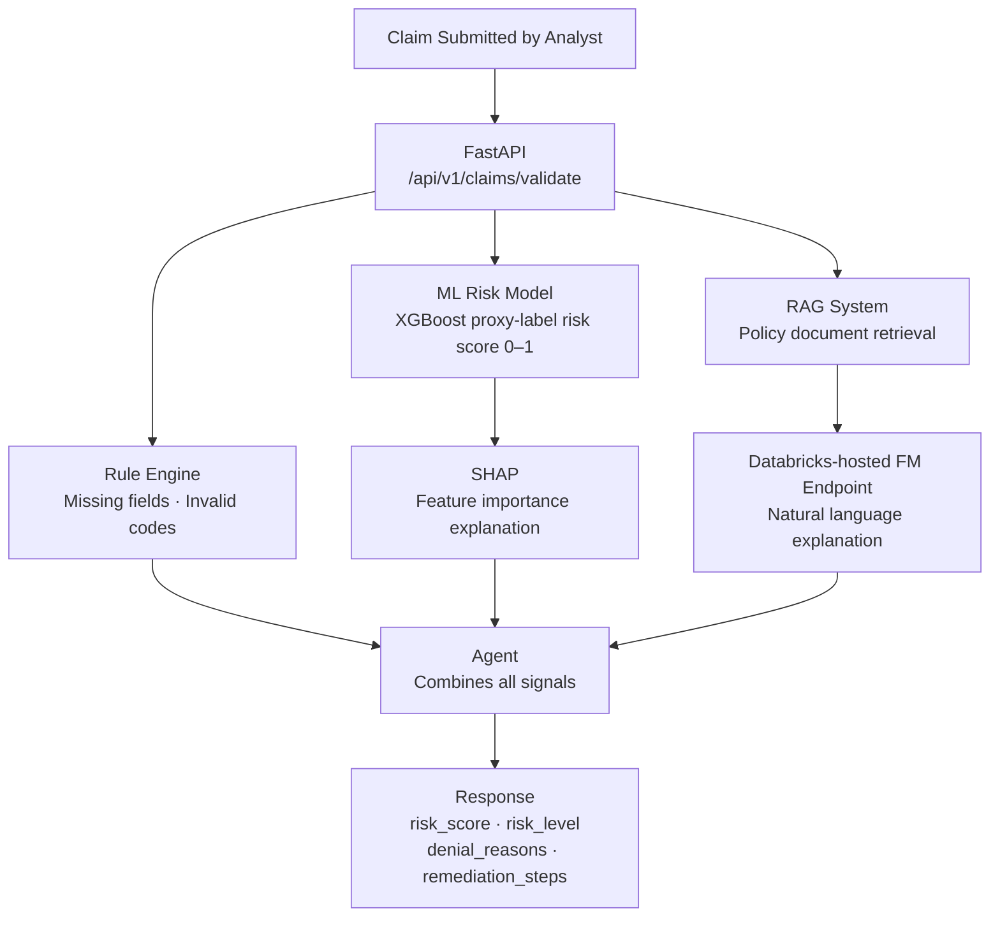

---

## 4. User Personas & Use Cases

### 4.1 User Types

#### Primary User: Billing / Claims Analyst

**Profile:** Medical billing professional with expertise in ICD-10, CPT codes, insurance requirements.

**Goals:**

- Submit clean claims on first pass
- Understand why a claim might be denied
- Get specific fix instructions without manual policy research

**Pain Points:**

- Too many claims to manually audit each one
- Policy documents are hundreds of pages — can't memorize all rules
- Denials found weeks later, not at submission time

**Use Cases:**
| ID | Use Case | Actor | Outcome |
|---|---|---|---|
| UC-01 | Submit claim for validation | Billing Analyst | Risk score + reasons + fix steps |
| UC-02 | View claim history dashboard | Billing Analyst | All past claims with status |
| UC-03 | Get policy explanation for denial reason | Billing Analyst | Policy excerpt backing the denial |
| UC-04 | Bulk upload claims for batch validation | Billing Analyst | Batch risk report |
| UC-05 | Download remediation report | Billing Analyst | PDF/CSV export of fix steps |

#### Secondary User: Billing Supervisor / Admin

**Goals:**

- Monitor team performance and denial rates
- Manage user access and permissions
- Review audit logs for compliance

**Use Cases:**
| ID | Use Case | Actor | Outcome |
|---|---|---|---|
| UC-06 | View team denial rate trends | Admin | Analytics dashboard |
| UC-07 | Manage user accounts | Admin | User CRUD operations |
| UC-08 | Export HIPAA audit logs | Admin | Compliance report |
| UC-09 | Configure business rules | Admin | Rule management UI |

#### Future Users (Out of Scope for v1)

- **Physician:** Documentation improvement suggestions pre-visit
- **Insurance Adjudicator:** Auto-adjudication verification
- **Patient:** Claim status tracking

### 4.2 User Journey — Primary Flow

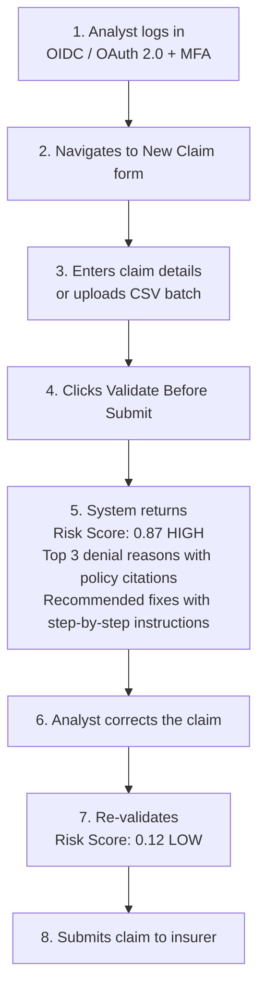

---

## 5. Test Cases by User Type

### 5.1 Billing Analyst Test Cases

| TC-ID | Test Case                                      | Input                                          | Expected Output                                                                            | Priority |
| ----- | ---------------------------------------------- | ---------------------------------------------- | ------------------------------------------------------------------------------------------ | -------- |
| TC-01 | Validate claim with missing procedure_code     | claim with null procedure_code                 | Risk=HIGH, Reason="Missing required procedure code", Fix="Add PROC code from CPT codebook" | P0       |
| TC-02 | Validate claim with missing billed_amount      | claim with null billed_amount                  | Risk=HIGH, Reason="Billing amount not provided", Fix="Enter billed amount"                 | P0       |
| TC-03 | Validate claim with overbilling (3x benchmark) | billed_amount=50000, expected=15000            | Risk=HIGH, Reason="Billed amount 233% above regional benchmark", policy reference          | P0       |
| TC-04 | Validate clean claim                           | All fields present, amounts within range       | Risk=LOW (<0.3), No critical flags                                                         | P0       |
| TC-05 | Provider-diagnosis specialty mismatch          | Cardiology provider, Bone diagnosis            | Risk=MEDIUM, Reason="Provider specialty mismatch with diagnosis category"                  | P1       |
| TC-06 | High-severity diagnosis, low-cost procedure    | D10 (Heart/High) + PROC6 (800 avg)             | Risk=MEDIUM, Reason="Low-cost procedure for high-severity cardiac diagnosis"               | P1       |
| TC-07 | Batch upload 50 claims                         | CSV file with mixed quality                    | Batch report with per-claim risk scores                                                    | P1       |
| TC-08 | Re-validate fixed claim                        | Previously HIGH claim with corrections applied | Risk=LOW, Score improved                                                                   | P1       |
| TC-09 | Request policy explanation for denial reason   | Denial reason ID                               | Policy excerpt + page citation                                                             | P2       |
| TC-10 | Download remediation report                    | Validated claim                                | PDF with risk score, reasons, steps                                                        | P2       |

### 5.2 Admin Test Cases

| TC-ID | Test Case                         | Input               | Expected Output                                        | Priority |
| ----- | --------------------------------- | ------------------- | ------------------------------------------------------ | -------- |
| TC-11 | Create new analyst user           | User details + role | User created, welcome email sent, MFA setup prompted   | P0       |
| TC-12 | Revoke user access                | User ID             | Tokens invalidated, sessions terminated immediately    | P0       |
| TC-13 | View audit log for specific claim | claim_id            | Full access history with timestamps, user IDs, actions | P0       |
| TC-14 | Export HIPAA compliance report    | Date range          | Audit log export with all PHI access events            | P0       |
| TC-15 | View team denial rate trend       | Last 30 days        | Chart showing daily denial rates per analyst           | P1       |

### 5.3 Security Test Cases

| TC-ID | Test Case                              | Expected Outcome                        | Priority |
| ----- | -------------------------------------- | --------------------------------------- | -------- |
| TC-16 | Unauthenticated API call               | 401 Unauthorized                        | P0       |
| TC-17 | Expired JWT token                      | 401 Unauthorized, redirect to login     | P0       |
| TC-18 | Analyst accessing admin endpoint       | 403 Forbidden                           | P0       |
| TC-19 | SQL injection in claim_id field        | Input rejected by Pydantic validation   | P0       |
| TC-20 | Rate limit exceeded (>100 req/min)     | 429 Too Many Requests                   | P0       |
| TC-21 | Session timeout (15 min inactivity)    | Auto-logout, re-authentication required | P0       |
| TC-22 | Brute-force login attempt (5 failures) | Account locked, admin notified          | P0       |

---

## 6. Functional Requirements

### 6.1 Data Ingestion & Processing (FR-DATA)

| ID         | Requirement                                                                                     |
| ---------- | ----------------------------------------------------------------------------------------------- |
| FR-DATA-01 | System SHALL ingest claims data from CSV, JSON, and streaming sources                           |
| FR-DATA-02 | System SHALL preserve all raw data in Bronze layer with ingestion timestamp and source metadata |
| FR-DATA-03 | System SHALL detect and flag missing fields (procedure_code, billed_amount, diagnosis_code)     |
| FR-DATA-04 | System SHALL standardize diagnosis codes, procedure codes, and provider IDs in Silver layer     |
| FR-DATA-05 | System SHALL join claims with provider, diagnosis, and cost benchmark tables in Gold layer      |
| FR-DATA-06 | System SHALL handle schema evolution without pipeline failure (Delta Lake schema evolution)     |
| FR-DATA-07 | System SHALL maintain full data lineage from source to Gold layer                               |
| FR-DATA-08 | System SHALL support incremental processing (only process new/changed records)                  |

### 6.2 ML Prediction (FR-ML)

| ID       | Requirement                                                                     |
| -------- | ------------------------------------------------------------------------------- |
| FR-ML-01 | System SHALL produce a claim denial risk score between 0 and 1                  |
| FR-ML-02 | System SHALL classify risk as LOW (<0.3), MEDIUM (0.3–0.7), or HIGH (>0.7)      |
| FR-ML-03 | System SHALL provide top-3 SHAP feature contributions for every prediction      |
| FR-ML-04 | During v1, system SHALL achieve >80% recall on proxy-labeled HIGH-risk claims   |
| FR-ML-05 | System SHALL version all models in MLflow registry                              |
| FR-ML-06 | System SHALL log model predictions with claim_id for audit purposes             |

### 6.3 RAG & Explanation (FR-RAG)

| ID        | Requirement                                                                          |
| --------- | ------------------------------------------------------------------------------------ |
| FR-RAG-01 | System SHALL retrieve relevant insurance policy passages for each denial reason      |
| FR-RAG-02 | System SHALL cite the specific policy document, section, and page number             |
| FR-RAG-03 | System SHALL generate human-readable explanations using Databricks Foundation Models |
| FR-RAG-04 | System SHALL NOT include PHI in prompts sent to the LLM                              |
| FR-RAG-05 | System SHALL return first-pass explanations and citations within 5 seconds            |

### 6.4 Agent & Remediation (FR-AGENT)

| ID          | Requirement                                                                                        |
| ----------- | -------------------------------------------------------------------------------------------------- |
| FR-AGENT-01 | System SHALL generate step-by-step remediation plans for each high-risk claim                      |
| FR-AGENT-02 | System SHALL prioritize fixes by impact (most likely to resolve denial first)                      |
| FR-AGENT-03 | System SHALL provide specific values to correct (e.g., "Change procedure_code from null to PROC2") |
| FR-AGENT-04 | System SHALL track whether recommended fixes were applied and re-validate                          |

### 6.5 API (FR-API)

| ID        | Requirement                                                                              |
| --------- | ---------------------------------------------------------------------------------------- |
| FR-API-01 | System SHALL expose a RESTful API with OpenAPI documentation                             |
| FR-API-02 | System SHALL authenticate all requests via OIDC/OAuth-issued JWT tokens                 |
| FR-API-03 | System SHALL enforce rate limiting (100 req/min per user, 1000 req/min per organization) |
| FR-API-04 | System SHALL validate all input with Pydantic models                                     |
| FR-API-05 | System SHALL return standardized error responses                                         |

### 6.6 Frontend (FR-UI)

| ID       | Requirement                                                                     |
| -------- | ------------------------------------------------------------------------------- |
| FR-UI-01 | System SHALL provide a claim submission form with real-time validation feedback |
| FR-UI-02 | System SHALL display risk score with color-coded indicator (GREEN/YELLOW/RED)   |
| FR-UI-03 | System SHALL display denial reasons with expandable policy citations            |
| FR-UI-04 | System SHALL display remediation steps as a checklist                           |
| FR-UI-05 | System SHALL provide a claims history dashboard with filters                    |
| FR-UI-06 | System SHALL support bulk CSV upload                                            |

---

## 7. Non-Functional Requirements

### 7.1 Performance

| ID          | Requirement                           | Target                    |
| ----------- | ------------------------------------- | ------------------------- |
| NFR-PERF-01 | Single-claim validation latency, risk path only (p95) | < 2 seconds   |
| NFR-PERF-02 | Batch claim validation (100 claims)   | < 30 seconds              |
| NFR-PERF-03 | Dashboard page load time              | < 1.5 seconds             |
| NFR-PERF-04 | API throughput                        | > 500 concurrent requests |
| NFR-PERF-05 | ML model inference (single claim, p95)     | < 150ms             |
| NFR-PERF-06 | RAG retrieval plus first explanation draft (p95) | < 5 seconds      |

### 7.2 Security

| ID         | Requirement                                                 |
| ---------- | ----------------------------------------------------------- |
| NFR-SEC-01 | All data in transit SHALL use TLS 1.3 minimum               |
| NFR-SEC-02 | All data at rest SHALL use AES-256 encryption               |
| NFR-SEC-03 | JWT access tokens SHALL expire in 15 minutes                |
| NFR-SEC-04 | Refresh tokens SHALL expire in 8 hours                      |
| NFR-SEC-05 | All PHI fields SHALL be masked in application logs          |
| NFR-SEC-06 | Failed login attempts SHALL lock account after 5 attempts   |
| NFR-SEC-07 | All API endpoints SHALL require authentication              |
| NFR-SEC-08 | System SHALL enforce RBAC with principle of least privilege |

### 7.3 Compliance

| ID          | Requirement                                                                     |
| ----------- | ------------------------------------------------------------------------------- |
| NFR-COMP-01 | System SHALL comply with HIPAA Technical Safeguards (45 CFR § 164.312)          |
| NFR-COMP-02 | System SHALL maintain append-only audit events with immutable long-term retention for minimum 6 years |
| NFR-COMP-03 | System SHALL implement automatic session timeout after 15 minutes of inactivity |
| NFR-COMP-04 | System SHALL provide emergency access procedures                                |
| NFR-COMP-05 | System SHALL NOT transmit PHI to external APIs or services                      |
| NFR-COMP-06 | Business Associate Agreement (BAA) SHALL be signed with Databricks              |

### 7.4 Reliability

| ID         | Requirement                    | Target                                   |
| ---------- | ------------------------------ | ---------------------------------------- |
| NFR-REL-01 | System availability            | 99.9% (8.7 hours/year downtime)          |
| NFR-REL-02 | Data pipeline failure recovery | Automatic retry with exponential backoff |
| NFR-REL-03 | ML model fallback              | Rule-based engine if ML unavailable      |
| NFR-REL-04 | RTO (Recovery Time Objective)  | < 1 hour                                 |
| NFR-REL-05 | RPO (Recovery Point Objective) | < 15 minutes                             |

### 7.5 Scalability

| ID           | Requirement                                                         |
| ------------ | ------------------------------------------------------------------- |
| NFR-SCALE-01 | System SHALL handle 10,000 claims/day initially, scalable to 1M/day |
| NFR-SCALE-02 | Databricks clusters SHALL auto-scale based on workload              |
| NFR-SCALE-03 | API layer SHALL scale horizontally (stateless)                      |
| NFR-SCALE-04 | Vector store SHALL support 1M+ policy document chunks               |

---

## 8. Assumptions & Constraints

### 8.1 Assumptions

| ID   | Assumption                                                                      | Rationale                                                                          |
| ---- | ------------------------------------------------------------------------------- | ---------------------------------------------------------------------------------- |
| A-01 | Dataset in `datasets/` folder is representative of production data schema       | Schema shows real-world claim structure (ICD codes, CPT codes, providers, amounts) |
| A-02 | Cloud provider will be AWS, GCP, or Azure (Databricks-supported)                | All architecture decisions are cloud-agnostic within this boundary                 |
| A-03 | Databricks BAA can be signed before production go-live                          | Required for HIPAA compliance                                                      |
| A-04 | Policy documents for RAG are non-PHI (insurance policy text)                    | Safe to use as LLM context                                                         |
| A-05 | Users will authenticate via an OIDC/OAuth 2.0-compatible identity provider with MFA support | Standards-based auth flow without vendor lock-in                                   |
| A-06 | The 8-week timeline is for development; production hardening occurs post-Week 8 | Reasonable for an end-to-end ML system                                             |
| A-07 | The claims dataset uses synthetic/anonymized data for development               | No real PHI in development environment                                             |

### 8.2 Constraints

| ID   | Constraint                                 | Impact                                                                                                          |
| ---- | ------------------------------------------ | --------------------------------------------------------------------------------------------------------------- |
| C-01 | No PHI to external LLM APIs                | Use Databricks Foundation Models only                                                                           |
| C-02 | 8-week development timeline                | Feature scope limited to core validation + ML + RAG + Agent                                                     |
| C-03 | HIPAA-eligible managed cloud deployment    | Managed services are allowed only with required compliance controls, BAA coverage, encryption, logging, and private connectivity |
| C-04 | Cloud provider not finalized               | Architecture designed so deployment target is a pluggable decision; no cloud-specific code in application layer |
| C-05 | Dataset schema is fixed (limited features) | ML model features derived from 4 tables only                                                                    |

---

## 9. Dataset Analysis

### 9.1 Schema Overview

**claims_1000.csv** (Primary table — 1,000 records)

| Column | Type | Notes |
|---|---|---|
| claim_id | VARCHAR | Unique identifier (C0001, C0002...) |
| patient_id | VARCHAR | Patient reference (P055, P177...) — PHI |
| provider_id | VARCHAR | Foreign key to providers table |
| diagnosis_code | VARCHAR | Foreign key to diagnosis table (D10–D60) — PHI |
| procedure_code | VARCHAR | Foreign key to cost table (PROC1–PROC6) — NULLABLE |
| billed_amount | FLOAT | Amount billed in INR — NULLABLE — PHI |
| date | DATE | Claim submission date |

**providers_1000.csv**

| Column | Type | Notes |
|---|---|---|
| provider_id | VARCHAR | Primary key |
| doctor_name | VARCHAR | Provider full name |
| specialty | VARCHAR | Medical specialty (Neurology, Cardiology, General...) |
| location | VARCHAR | City (Bangalore, Mumbai...) — NULLABLE |

**diagnosis.csv** (Lookup)

| Column | Type | Notes |
|---|---|---|
| diagnosis_code | VARCHAR | D10=Heart, D20=Bone, D30=Fever, D40=Skin, D50=Diabetes, D60=Cold |
| category | VARCHAR | Diagnosis category |
| severity | VARCHAR | High \| Low |

**cost.csv** (Lookup)

| Column | Type | Notes |
|---|---|---|
| procedure_code | VARCHAR | PROC1–PROC6 |
| average_cost | INTEGER | Historical average cost in INR |
| expected_cost | INTEGER | Expected/benchmark cost in INR |
| region | VARCHAR | Regional benchmark (Delhi, Mumbai, Bangalore...) |

### 9.2 Data Quality Issues Identified

| Issue                     | Affected Column       | Bronze Treatment           | Silver Treatment                          |
| ------------------------- | --------------------- | -------------------------- | ----------------------------------------- |
| Missing procedure_code    | claims.procedure_code | Store null as-is with flag | Flag as `is_procedure_missing=True`       |
| Missing billed_amount     | claims.billed_amount  | Store null as-is with flag | Flag as `is_amount_missing=True`          |
| Missing provider location | providers.location    | Store null as-is           | Impute with "Unknown"                     |
| No denied/approved label  | claims table          | N/A                        | Derive a rule-based proxy label for v1 training; treat it as a surrogate target, not a true payer outcome |

### 9.3 Derived Denial Risk Features (Gold Layer)

| Feature                        | Derivation                                | Denial Signal |
| ------------------------------ | ----------------------------------------- | ------------- |
| `is_procedure_missing`         | procedure_code IS NULL                    | Very High     |
| `is_amount_missing`            | billed_amount IS NULL                     | Very High     |
| `amount_to_benchmark_ratio`    | billed_amount / expected_cost             | > 1.5 = High  |
| `severity_procedure_mismatch`  | High-severity dx + low-cost procedure     | Medium        |
| `specialty_diagnosis_mismatch` | Provider specialty ≠ diagnosis category   | Medium        |
| `provider_location_missing`    | location IS NULL                          | Low           |
| `claim_frequency`              | Count of claims per provider last 30 days | Context       |
| `diagnosis_severity`           | From diagnosis.severity (High=1, Low=0)   | Context       |

---

## 10. Technology Stack with Rationale

Every technology choice is justified against alternatives.

### 10.1 Data & ML Platform

| Component              | Choice                                              | Alternatives Considered                     | Why This Choice                                                                                                                                                                                        |
| ---------------------- | --------------------------------------------------- | ------------------------------------------- | ------------------------------------------------------------------------------------------------------------------------------------------------------------------------------------------------------ |
| Data Platform          | **Databricks**                                      | Apache Airflow + Spark standalone, AWS Glue | Unified platform for ETL, ML, and serving. Native Delta Lake, Unity Catalog for governance, MLflow built-in. HIPAA controls and BAA support are available when the required compliance configuration is enabled. |
| Storage Format         | **Delta Lake**                                      | Parquet, Iceberg                            | ACID transactions (no partial writes = data integrity for HIPAA), time-travel for audit, Change Data Feed for incremental processing. Z-ordering/liquid clustering for query performance.              |
| ETL Orchestration      | **Lakeflow Spark Declarative Pipelines (SDP)**      | Manual Auto Loader notebooks, Apache Spark structured streaming | Databricks' production-grade ETL framework. Pipeline logic in plain `.sql`/`.py` files — not notebooks — enabling version control and CI/CD via Databricks Asset Bundles. Manages checkpointing, schema evolution, and incremental state automatically via `read_files()`. |
| Catalog & Governance   | **Unity Catalog**                                   | Apache Ranger, AWS Lake Formation           | Centralized governance for all Databricks assets. Fine-grained access control at row/column level. Automatic data lineage tracking. HIPAA audit requirement met natively.                              |
| ML Framework           | **XGBoost + SHAP**                                  | Random Forest, LightGBM, Neural Networks    | XGBoost fits tabular risk scoring well and is easy to operationalize. SHAP improves analyst trust, debugging, and model governance. In v1 this model is explicitly calibrated on proxy labels, not true payer outcomes. |
| ML Tracking            | **MLflow**                                          | Weights & Biases, Neptune                   | Built into Databricks. Model versioning, experiment tracking, model registry. Promotes models: Development → Staging → Production.                                                                     |
| LLM / Foundation Model | **Databricks-hosted Foundation Model API endpoint** | OpenAI direct API, Anthropic direct API     | Keeps inference inside the Databricks security perimeter. The exact model endpoint is selected at deployment time from the current supported Databricks-hosted models based on region, compliance, latency, and cost. |
| Vector Store           | **Databricks Vector Search**                        | ChromaDB, Pinecone, Weaviate                | Native integration with Delta tables and Databricks governance. Reduces infrastructure sprawl. Application-layer filters must still be enforced for document isolation because vector indexes do not replace tenant-level authorization logic. |
| Embedding Model        | **Databricks GTE Large (managed embeddings)**       | Self-hosted sentence-transformers, Cohere   | Simplifies the RAG path by using a Databricks-hosted embedding endpoint within the same managed platform and security perimeter.                                                                        |

### 10.2 Backend

| Component            | Choice                     | Alternatives Considered                  | Why This Choice                                                                                                                                                                                                                         |
| -------------------- | -------------------------- | ---------------------------------------- | --------------------------------------------------------------------------------------------------------------------------------------------------------------------------------------------------------------------------------------- |
| API Framework        | **FastAPI 0.115+**         | Flask, Django REST Framework, Express.js | Async-native (handles concurrent claim submissions). Pydantic v2 for strict input validation (prevents injection attacks, validates claim schema). Auto-generates OpenAPI docs (audit trail). Python ecosystem = direct ML integration. |
| Input Validation     | **Pydantic v2**            | Marshmallow, Cerberus                    | Fastest Python validator. Type-safe claim schema enforcement. Rejects malformed input at boundary.                                                                                                                                      |
| Authentication       | **OIDC + Authorization Code + PKCE + JWT** | API Keys, Session Cookies, password-only auth | Standards-based login flow with a provider-agnostic identity layer. Keeps the architecture portable while following current OAuth 2.x best practices. |
| Rate Limiting        | **slowapi**                | Custom middleware                        | Per-user rate limits. Token bucket allows burst while preventing sustained abuse.                                                                                                                                                       |
| Database (App State) | **PostgreSQL**             | MySQL, SQLite, MongoDB                   | HIPAA audit logs require ACID compliance. Relational model for user/session/audit data. pgcrypto for column-level encryption of PHI.                                                                                                    |
| ORM                  | **SQLAlchemy 2.0 (async)** | Tortoise ORM, raw SQL                    | Async support for FastAPI. Type-safe queries. Alembic migrations for schema version control.                                                                                                                                            |

### 10.3 Frontend

| Component           | Choice                      | Alternatives Considered | Why This Choice                                                                                                                                                                                 |
| ------------------- | --------------------------- | ----------------------- | ----------------------------------------------------------------------------------------------------------------------------------------------------------------------------------------------- |
| Dashboard Framework | **Streamlit**               | React + Next.js, Dash   | Python-native and fast to deliver for an internal analyst console. Strong fit for a training-project scope where the main goal is architecture clarity, not pixel-perfect public product UX. |
| Auth (Frontend)     | **Streamlit native OIDC**   | streamlit-authenticator, custom JWT handling | Keeps frontend authentication provider-agnostic and separates login concerns from application authorization.                                                             |
| Charts              | **Plotly**                  | Matplotlib, Altair      | Interactive charts (hover, zoom, filter). Well-supported in Streamlit.                                                                                                                          |

---

## 11. System Architecture (High-Level)

### 11.1 Architecture Diagram

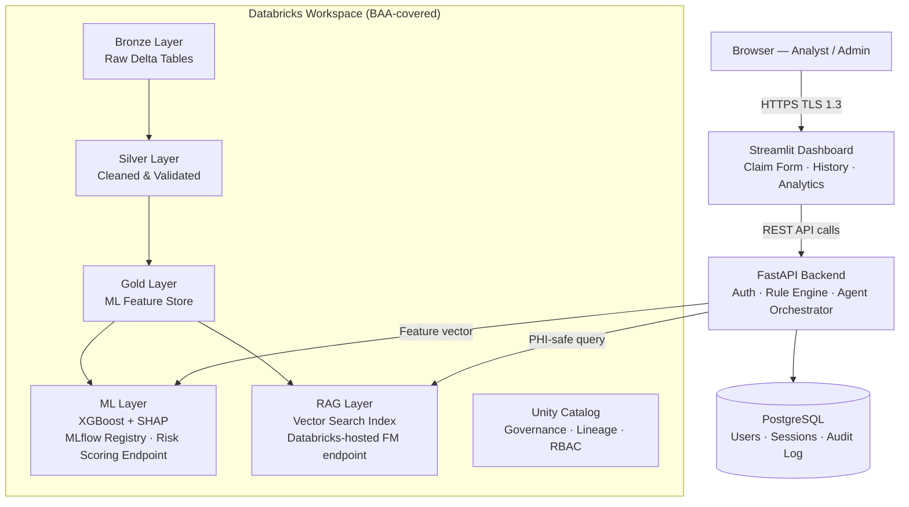

### 11.2 Component Responsibilities

| Component  | Responsibility                                                                              |
| ---------- | ------------------------------------------------------------------------------------------- |
| Streamlit  | Analyst dashboard UI — claim form, risk display, remediation checklist, history              |
| FastAPI    | Business logic, token validation, orchestrates Rule Engine → ML → RAG → Agent                |
| PostgreSQL | Users, sessions, append-only audit log, application state                                    |
| Databricks | Medallion ETL, ML training + serving, RAG (Vector Search + Foundation Model), Unity Catalog  |

---

## 12. Data Architecture — Medallion

### 12.1 Medallion Architecture Diagram

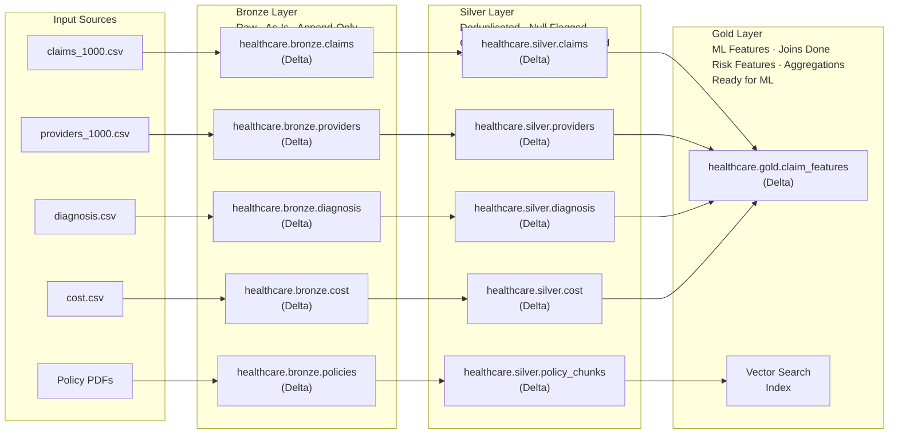

### 12.2 Bronze Layer — Raw Ingestion

**Purpose:** Land data exactly as received. Never transform. Never delete.

**Why Bronze is non-negotiable for HIPAA:**
The architecture needs the ability to reconstruct the original state of ingested records for audits, disputes, and incident review. Bronze retention plus Delta time-travel supports that requirement.

**Implementation Approach:**

Bronze tables are defined as Lakeflow Spark Declarative Pipeline (SDP) streaming tables using `read_files()` with `format=csv`, `header=true`, `inferColumnTypes=true`, and `schemaEvolutionMode=addNewColumns`. Checkpoint location and schema state are managed automatically by SDP. TBLPROPERTIES are declared inline at table creation — not applied retroactively — keeping configuration declarative and version-controlled within the Databricks Asset Bundle. The landing zone path is configured in the pipeline configuration, not hardcoded.

### 12.3 Silver Layer — Cleaned & Validated

**Purpose:** Resolve data quality issues. Standardize. Join dimensions. No aggregation.

**Transformation Rules:**

| Column            | Bronze State | Silver Treatment                            |
| ----------------- | ------------ | ------------------------------------------- |
| procedure_code    | NULL allowed | Flag `is_procedure_missing=True`; keep NULL |
| billed_amount     | NULL allowed | Flag `is_amount_missing=True`; keep NULL    |
| diagnosis_code    | String       | Validate against `clean_diagnosis` lookup   |
| provider_id       | String       | Validate against `clean_providers` lookup   |
| date              | String       | Cast to DateType, reject invalid dates      |
| provider.location | NULL         | Fill with 'Unknown'                         |

**Implementation Approach:**

Silver reads incrementally from Bronze via Change Data Feed. Transformations apply null flags, type casts, and deduplication (keep latest record per `claim_id`). Audit columns `_silver_processed_at` and `_data_quality_flags` are added. Results are merged (upserted) into `healthcare.silver.claims` on `claim_id`.

### 12.4 Gold Layer — Business & ML-Ready Features

**Purpose:** Compute all features needed for ML model. One-stop-shop for analytics.

**Implementation Approach:**

Gold joins all four Silver tables (claims, providers, diagnosis, cost) and computes the eight denial risk features defined in Section 9.3. A rule-based `denial_label` is derived as a proxy training target. The result is written to `healthcare.gold.claim_features` as the ML feature store.

---

## 13. ML/AI Architecture

### 13.1 ML Architecture Diagram

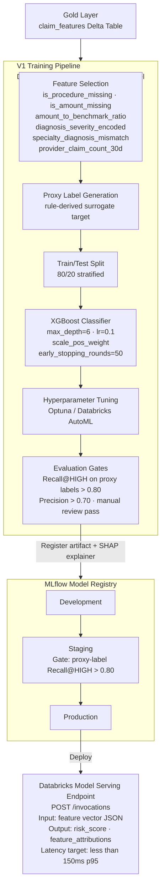

### 13.2 Explainability and Governance

Explainability is included for analyst trust, debugging, and model governance. In this project, SHAP supports transparent risk scoring and remediation, but it is **not** presented as a standalone HIPAA mandate.

The model is packaged as an MLflow `pyfunc` model that returns risk score (0–1), risk level (LOW/MEDIUM/HIGH), and top-3 SHAP feature contributions per prediction. The SHAP explainer is pre-computed and bundled with the model artifact at registration time.

### 13.3 Model Governance

- **Model versioning:** Every trained model registered in MLflow with full parameter lineage
- **Promotion gates:** Staging → Production requires proxy-label quality gates plus analyst review
- **Drift detection:** Weekly data drift check using Evidently AI (population stability index)
- **Retraining trigger:** Automatic retraining if PSI > 0.2 or model accuracy drops >5%
- **Audit log:** Every prediction logged with claim_id, model_version, risk_score, timestamp
- **v1 limitation:** Until real adjudication outcomes are available, model metrics are treated as proxy quality signals rather than proof of payer-level predictive accuracy

---

## 14. RAG Architecture

### 14.1 RAG Architecture Diagram

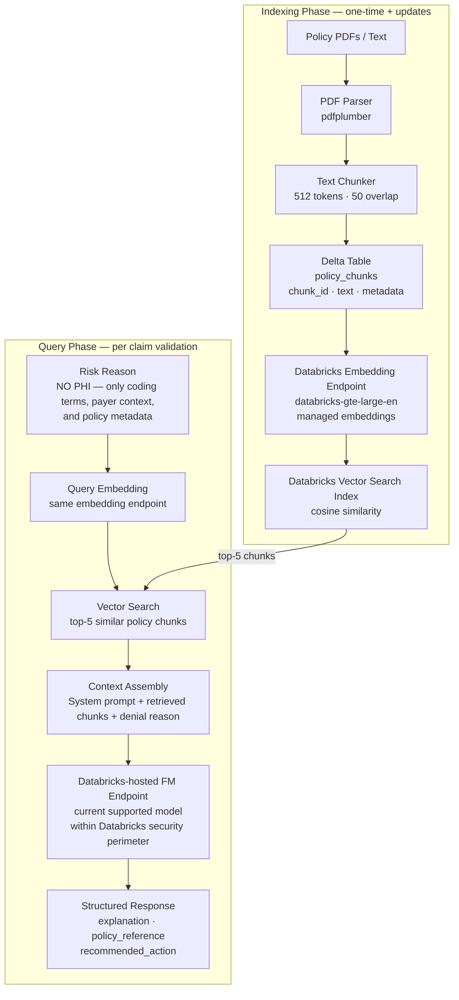

### 14.2 PHI Firewall — Critical HIPAA Control

The RAG query NEVER includes PHI. The query is constructed from denial features only — diagnosis category, procedure status, and denial reason codes. Patient identifiers, names, dates, and billed amounts are never included. Example query: `"missing procedure code for Heart diagnosis overbilling detected"` — no PHI.

For v1, deployment is single-organization. If the platform is later expanded to multiple organizations, every indexed document must carry `org_id`, `payer_id`, and policy metadata, and the application layer must enforce those filters on every Vector Search query. Vector Search endpoint ACLs do not replace application-level document isolation.

### 14.3 LLM Prompt Design Principles

The LLM is prompted as a healthcare billing compliance assistant that answers strictly from retrieved policy documents. Key constraints enforced in the system prompt:

- Respond only from retrieved policy context — no hallucinated policy references
- Never include patient information in the response
- Always cite the specific policy section referenced
- Low temperature (factual, deterministic responses)

The structured output per explanation request: brief explanation (2–3 sentences), specific policy reference, and recommended corrective action.

---

## 15. Agent Architecture

### 15.1 Agent Architecture Diagram

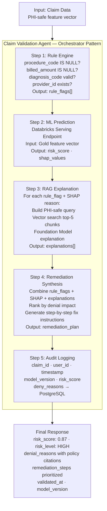

---

## 16. API Architecture

### 16.1 API Architecture Diagram

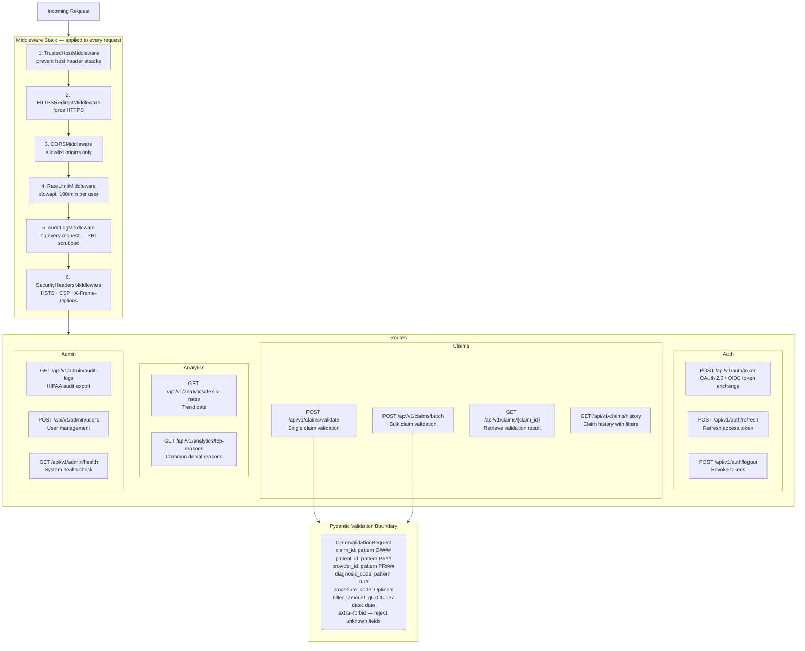

### 16.2 Error Response Standard

All errors follow RFC 7807 Problem Details format, returning a structured JSON body with `type` (error URI), `title`, `status` (HTTP code), `detail` (human-readable reason), `instance` (request path), `request_id`, and `timestamp`.

---

## 17. Frontend Architecture

### 17.1 Frontend Architecture Diagram

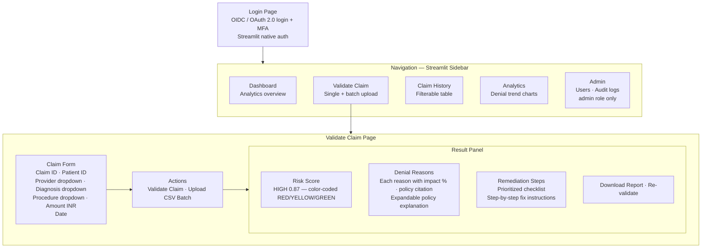

### 17.2 Session Management (App-Enforced Auto-Logoff Policy)

Streamlit's identity cookie can outlive an individual browser session, so the application enforces its own inactivity timeout policy for regulated workflows and requires re-authentication for protected pages. The 15-minute timeout is checked on every page interaction — on expiry, the session state is cleared and the user is logged out.

---

## 18. Security Architecture

### 18.1 Security Architecture Diagram

```mermaid
flowchart TD
    A[Security Architecture<br/>Defense in Depth - 5 Layers]
    A --> B[Layer 1: Network Perimeter<br/>Firewall: only ports 443 and 22<br/>WAF: OWASP Top 10 rules at gateway<br/>DDoS protection: network-level rate limiting<br/>VPC or VLAN segmentation for app, data, and admin]
    B --> C[Layer 2: Application Security<br/>TLS 1.3 minimum for all connections<br/>HSTS and CSP headers enabled<br/>OIDC plus Authorization Code plus PKCE<br/>JWT for API authorization<br/>RBAC for billing_analyst, billing_admin, and read_only<br/>Pydantic input validation at every boundary<br/>Rate limiting: 100 req/min per user, 1000/min per org]
    C --> D[Layer 3: Data Security<br/>AES-256 encryption at rest<br/>TLS 1.3 in transit<br/>PHI masking in logs: patient_id becomes P***<br/>Column-level encryption in PostgreSQL using pgcrypto<br/>90-day key rotation<br/>Delta Lake ACID guarantees for data integrity]
    D --> E[Layer 4: Identity and Access<br/>Least privilege for structured data and APIs<br/>Unity Catalog and DB grants for structured tables<br/>Application-layer filters for Vector Search and policy retrieval<br/>Service accounts for Databricks jobs<br/>Secret rotation via cloud-native secret store<br/>MFA required for all human users]
    E --> F[Layer 5: Audit and Monitoring<br/>Append-only audit log in PostgreSQL with immutable export<br/>Log every PHI access: who, what, when, and source<br/>Alert on failed logins and unusual access patterns<br/>Databricks audit logs for queries, jobs, and model calls<br/>Retention aligned to compliance and enterprise policy]
```

### 18.2 Security Threat Model

| Threat                  | Attack Vector                    | Mitigation                                                                                |
| ----------------------- | -------------------------------- | ----------------------------------------------------------------------------------------- |
| Unauthorized PHI access | Stolen credentials               | MFA + short-lived JWT + session timeout                                                   |
| SQL injection           | Malformed claim_id input         | Pydantic regex validation + parameterized queries                                         |
| XSS                     | Malicious script in claim fields | CSP header + input sanitization + Pydantic                                                |
| JWT forgery             | Tampered token                   | RS256 signing (asymmetric key) + token rotation                                           |
| Man-in-the-middle       | HTTP traffic interception        | TLS 1.3 mandatory + HSTS                                                                  |
| Insider threat          | Admin accessing all PHI          | RBAC + Unity Catalog row-level security + audit logs                                      |
| DDoS                    | High request volume              | Rate limiting at application layer (slowapi) + network-level protection via reverse proxy |
| Data exfiltration       | Bulk export of PHI               | Row-level limits on queries + export audit logging                                        |
| Supply chain attack     | Malicious dependency             | Pinned dependencies + vulnerability scanning (Snyk/Trivy)                                 |
| LLM data leakage        | PHI in RAG prompt                | PHI firewall in query builder (see Section 14.2)                                          |

---

## 19. HIPAA Compliance Framework

This section maps the proposed controls to HIPAA-oriented design responsibilities. It is an architecture control map, not legal advice; final compliance depends on enabled platform features, BAA execution, cloud controls, and operating procedures.

### 19.1 HIPAA Technical Safeguards (45 CFR § 164.312) — Control Mapping

| HIPAA Standard | Citation | Our Implementation | Notes | Status |
| -------------- | -------- | ------------------ | ----- | ------ |
| Access control | § 164.312(a)(1) | Unique user identity via identity-provider subject, RBAC, and scoped JWTs | Least privilege enforced at UI, API, and data layers | ✅ |
| Emergency access procedure | § 164.312(a)(2)(ii) Required | Break-glass admin account with extra audit and approval | Operational runbook control | ✅ |
| Automatic logoff | § 164.312(a)(2)(iii) Addressable | 15-minute inactivity timeout policy in the UI plus short-lived API tokens | Implemented as a security policy, not a fixed statutory timer | ✅ |
| Audit controls | § 164.312(b) | Append-only audit events in PostgreSQL, Databricks audit logs, immutable export | Long-term retention handled by enterprise policy | ✅ |
| Integrity | § 164.312(c)(1) | Delta ACID transactions, checksums, controlled writes | Protects against unauthorized alteration | ✅ |
| Person or entity authentication | § 164.312(d) | OIDC/OAuth 2.0-compatible identity provider plus MFA | Supports analyst and admin identity verification | ✅ |
| Transmission security | § 164.312(e)(1) | TLS 1.3, HSTS, secure service-to-service traffic | Applies to app, Databricks, and storage integrations | ✅ |

### 19.2 HIPAA Administrative Safeguards — Key Controls

| Control                      | Implementation                             |
| ---------------------------- | ------------------------------------------ |
| Security Officer             | Designated in deployment runbook           |
| Risk Analysis                | Threat model documented in Section 18.2    |
| Workforce Training           | Required before system access              |
| Access Management            | RBAC via IdP groups, FastAPI, and Databricks grants |
| Incident Response            | Defined in monitoring runbook              |
| Business Associate Agreement | Required with Databricks before production |
| Data Backup                  | Delta Lake time-travel + daily snapshots   |
| Disaster Recovery            | RTO < 1hr, RPO < 15min (see NFR-REL)       |

### 19.3 Data Classification

| Data Type             | Classification | Storage             | Access                  |
| --------------------- | -------------- | ------------------- | ----------------------- |
| patient_id            | PHI            | Encrypted (AES-256) | billing_analyst + above |
| claim_id              | PHI-adjacent   | Standard            | All authenticated users |
| billed_amount         | PHI            | Encrypted           | billing_analyst + above |
| diagnosis_code        | PHI            | Encrypted           | billing_analyst + above |
| ML features (derived) | Sensitive derived data | Standard Delta      | ML service account      |
| Audit logs            | Compliance     | Append-only PostgreSQL + immutable export | admin only              |
| Model explanations    | Non-PHI        | Standard            | All authenticated       |
| Policy documents      | Non-PHI        | Standard Delta      | RAG service account     |

---

## 20. Identity & Authorization Flow

The platform uses **OpenID Connect (OIDC)** for user authentication and the **OAuth 2.0 Authorization Code flow with PKCE** for secure token issuance. The architecture intentionally stays provider-agnostic so the exact identity platform can be chosen later without changing the application flow.

### 20.1 OIDC Authentication + OAuth 2.0 Authorization Code Flow with PKCE

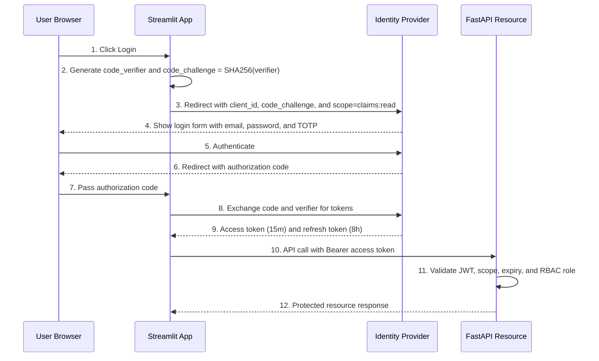

JWT claims include: `sub` (user ID), `role`, `org_id`, `scope`, `iat`/`exp`, and `jti` (unique token ID for revocation).

### 20.2 JWT Security Implementation

Access tokens are signed with RS256 (asymmetric — private key signs, public key verifies). Expiry is 15 minutes for access tokens, 8 hours for refresh tokens. Every token carries a unique `jti` that is checked against a revocation list on each request, enabling immediate invalidation on logout or account suspension.

---

## 21. Deployment

The system is deployed on a **HIPAA-eligible managed cloud architecture**. The specific cloud provider (AWS / GCP / Azure) has not been finalized — this is a business decision made separately. The application architecture is designed so that this choice does not affect core business logic, while networking and storage details can vary by provider.

**What stays the same regardless of cloud:**

- FastAPI, Streamlit, and PostgreSQL are standard Python services — they run anywhere
- Databricks is available natively on all three major clouds; only the underlying storage differs (S3 / GCS / ADLS Gen2)
- All communication is over HTTPS (TLS 1.3). All credentials are injected at runtime — nothing sensitive is baked into code or config files
- Managed services are acceptable only when they support required compliance controls, encryption, audit logging, and private connectivity

**Key deployment constraint for HIPAA-oriented design:**
PHI, audit events, and production data flows must remain inside the approved compliance boundary for the chosen cloud deployment. Managed platform services are allowed only when configured with the required security profile, encryption, logging, and private-network controls. External exposure is minimized to authenticated HTTPS entry points.

---

## 22. Exception Handling Strategy

### 22.1 Exception Hierarchy

All exceptions extend a base `ClaimGuardException` that automatically logs to the audit system on creation with PHI masked. HTTP status codes are declared on the exception class so the API layer maps them consistently.

| Exception | HTTP Status | Trigger |
|---|---|---|
| DataValidationException | 422 | Input fails Pydantic validation |
| MLPredictionException | 503 | ML endpoint unavailable or invalid response |
| RAGException | 503 | Vector Search or LLM call fails |
| DatabricksConnectionException | 503 | Databricks cluster unreachable |
| AuthorizationException | 403 | User lacks permission for resource |

### 22.2 Fallback Strategy

| Component       | Primary                     | Fallback                                                       | Behavior                                                                                 |
| --------------- | --------------------------- | -------------------------------------------------------------- | ---------------------------------------------------------------------------------------- |
| ML Prediction   | Databricks Serving Endpoint | Rule-based engine                                              | If ML unavailable, use deterministic rules. Flag response as "rule_based=true"           |
| RAG Explanation | Vector Search + Databricks-hosted FM endpoint | Pre-cached generic explanations                                | If LLM unavailable, return generic policy reference. Flag as "explanation_source=cached" |
| Database        | PostgreSQL primary          | Graceful degradation (read-only mode)                          | Write operations are queued and retried; read queries continue from replica              |
| Databricks ETL  | Scheduled job               | Retry with exponential backoff (max 3 retries, 5min intervals) | Alert after 3 failures                                                                   |

### 22.3 Data Pipeline Exception Handling

Bad records are quarantined to a separate location rather than failing the pipeline — the pipeline continues processing valid records. A monitoring check alerts if more than 5% of records in a batch are quarantined, indicating a systemic data quality issue requiring investigation.

---

## 23. HIPAA Audit Logging

HIPAA requires retention of required security documentation for 6 years under 45 CFR § 164.316(b)(2)(i). This architecture applies the same long-term retention posture to audit events so access and security activity can be reconstructed during investigations, reviews, and compliance reporting.

All application logs are structured JSON with PHI values scrubbed (only IDs logged, never names, dates of birth, or amounts).

### 23.1 HIPAA Audit Logging Schema

The `audit_log` table in PostgreSQL is append-only (UPDATE/DELETE/TRUNCATE revoked from all roles). Row-level security restricts reads to audit admins only. The table is partitioned by month for retention management.

| Column | Type | Notes |
|---|---|---|
| audit_id | UUID | Auto-generated primary key |
| event_time | TIMESTAMPTZ | Indexed with user_id for fast HIPAA queries |
| user_id | UUID | References users table |
| user_email | TEXT | Not masked in audit logs |
| action | TEXT | e.g., `CLAIM_VALIDATED`, `PHI_ACCESSED` |
| resource_type | TEXT | e.g., `claim`, `user`, `report` |
| resource_id | TEXT | claim_id — kept for audit, access controlled |
| ip_address | INET | Required |
| request_id | UUID | Correlates to API request |
| outcome | TEXT | `SUCCESS` \| `FAILURE` \| `DENIED` |
| metadata | JSONB | Additional context — NO PHI values, only IDs |

Long-term retention should be enforced by exporting completed audit partitions to immutable object storage or a SIEM/WORM target according to enterprise retention policy.

---

## 24. Cost Estimation

### 24.1 Development Environment (Monthly)

| Component         | Service                                      | Est. Cost/Month |
| ----------------- | -------------------------------------------- | --------------- |
| Databricks        | Databricks Free Edition or free trial        | **~$0 to $25**  |
| Vector Search     | Small demo index / trial usage               | **~$0 to $10**  |
| Foundation Models | Low-volume dev usage / trial credits         | **~$0 to $10**  |
| PostgreSQL        | Local (dev machine)                          | **FREE**        |
| **Dev Total**     | Demo / prototyping only, not HIPAA-eligible  | **~$0 to $50/month** |

### 24.2 Staging Environment (Monthly)

> Exact figures depend on the cloud provider selected and on whether compliance/security add-ons are enabled. These are planning ranges, not vendor quotes.

| Component                  | Service / Assumption                                | Est. Cost/Month |
| -------------------------- | --------------------------------------------------- | --------------- |
| Databricks ETL + serving   | Small HIPAA-eligible staging footprint              | **~$700 to $1,100** |
| Vector Search + embeddings | Limited policy corpus and low query volume          | **~$100 to $250** |
| Foundation Model API       | Controlled staging usage                            | **~$25 to $150** |
| PostgreSQL + backup        | Managed instance with backups                       | **~$80 to $200** |
| Compliance / logging / networking | Private connectivity, monitoring, security controls | **~$150 to $400** |
| **Staging Total**          |                                                     | **~$1,055 to $2,100/month** |

### 24.3 Production Environment (Monthly)

| Component                | Service / Assumption                 | Est. Cost/Month   |
| ------------------------ | ------------------------------------ | ----------------- |
| Databricks ETL           | Job clusters / serverless pipelines  | **~$700 to $1,200** |
| Databricks ML Serving    | Auto-scaling risk scoring endpoint   | **~$200 to $500** |
| Databricks Vector Search | Managed index                        | **~$150 to $400** |
| Foundation Model API     | Databricks-hosted FM explanation calls | **~$50 to $300** |
| App hosting              | FastAPI + Streamlit + PostgreSQL     | **~$300 to $700** |
| Storage / backup / logging | Delta storage, backups, observability | **~$100 to $400** |
| Compliance / networking  | Private connectivity and security controls | **~$150 to $500** |
| **Production Total**     |                                      | **~$1,650 to $4,000/month** |

### 24.4 Cost Optimization Strategies (Databricks-Focused)

| Strategy                                   | Savings                                      | How                                               |
| ------------------------------------------ | -------------------------------------------- | ------------------------------------------------- |
| Spot instances for ETL job clusters        | 60–70% on Databricks compute                 | Non-interactive jobs tolerate spot interruption   |
| Job clusters (not all-purpose clusters)    | 30–40%                                       | Auto-terminate after job; don't pay for idle time |
| Predictive optimization                    | Reduces wasted compute on OPTIMIZE/VACUUM    | Enable on all Unity Catalog managed tables        |
| Liquid clustering (vs manual partitioning) | Better query performance, less storage waste | Use on `claim_features` Gold table                |
| Model tiering                              | Reduces LLM cost                             | Use smaller FM for draft explanations, richer model only on escalation |
| Explanation caching                        | Avoids repeated FM calls                     | Cache common denial-reason explanations with citations |
| Triggered Vector Search sync               | Reduces idle indexing cost                   | Rebuild or sync only when policy corpus changes   |

---

## 25. Testing Strategy

### 25.1 Testing Pyramid

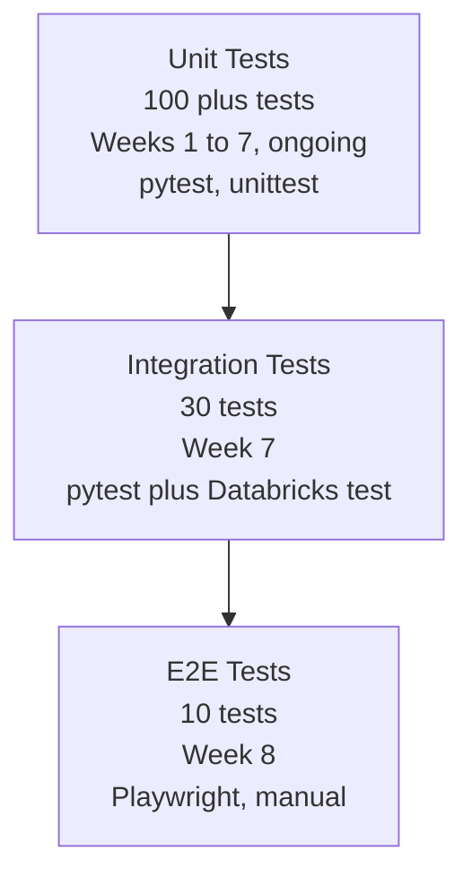

### 25.2 Unit Tests (Target: 100+ tests)

| Area                | What to Test                                                    |
| ------------------- | --------------------------------------------------------------- |
| Rule Engine         | Each rule flag: null checks, range checks, code validation      |
| Pydantic Models     | Valid input, invalid input, boundary values, injection attempts |
| Feature Engineering | Each derived feature: correct calculation, null handling        |
| JWT Auth            | Token creation, expiry, revocation, invalid signatures          |
| PHI Firewall        | Verify claim_id/patient_id never appear in RAG query string     |
| SHAP Output         | Feature names match, values sum correctly                       |
| Audit Logger        | PHI masking: patient_id appears as P\*\*\* in log output        |

### 25.3 Integration Tests

| Area                   | What to Test                                              |
| ---------------------- | --------------------------------------------------------- |
| Bronze → Silver → Gold | End-to-end claim flows through Medallion layers           |
| ML Endpoint            | Databricks serving endpoint returns valid risk_score      |
| RAG Pipeline           | Policy retrieval returns relevant chunks, no PHI in query |
| Agent Synthesis        | Full validation flow returns expected response structure  |
| Auth Flow              | Full OIDC / OAuth 2.0 Authorization Code + PKCE flow, token refresh, revocation |
| Rate Limiting          | 101st request in 1 minute returns 429                     |

### 25.4 Model Testing

| Test                         | Threshold                 | Frequency          |
| ---------------------------- | ------------------------- | ------------------ |
| Recall @ HIGH risk           | > 80%                     | Every training run |
| Precision                    | > 70%                     | Every training run |
| AUC-ROC                      | > 0.85                    | Every training run |
| Prediction latency (p95)     | < 150ms                   | Every deployment   |
| Data drift (PSI)             | < 0.2                     | Weekly             |
| Feature importance stability | Top 3 features consistent | Weekly             |

---

## 26. Development Roadmap — 8 Weeks

### 26.1 Gantt View

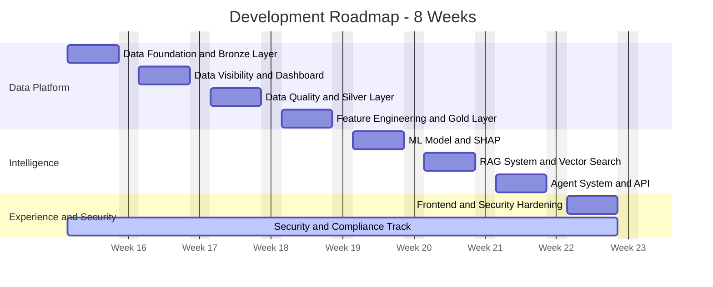

### 26.2 Week-by-Week Deliverables

#### Week 1 — Data Foundation (Bronze Layer)

**Goal:** Working data ingestion pipeline, raw data in Delta Lake

**Tasks:**

- Set up Databricks workspace + Unity Catalog (`healthcare` catalog) and `healthcare.bronze` schema
- Initialise SDP project using `databricks pipelines init` — creates a Databricks Asset Bundle (DAB); pipeline logic in `.sql`/`.py` files, not notebooks
- Define Bronze streaming table pipelines using `read_files()` for claims, providers, diagnosis, cost CSVs
- Declare HIPAA TBLPROPERTIES inline in each pipeline definition: Change Data Feed + 6-year log retention (45 CFR § 164.316(b)(2)(i))
- Configure audit columns: `_ingested_at`, `_source_file` (`_metadata.file_path`), `_pipeline_run_id`
- Apply Unity Catalog RBAC to all four Bronze tables: ETL service account (INSERT only), billing analyst role (SELECT only)

**Exit Criteria:** All 4 datasets ingested into `healthcare.bronze.*` Delta tables; 100% row count match with source CSVs; SDP pipeline re-run produces no duplicate rows (idempotent); TBLPROPERTIES verified via `DESCRIBE EXTENDED`; RBAC confirmed (analyst SELECT succeeds, INSERT denied)

---

#### Week 2 — Data Visibility (Initial Dashboard)

**Goal:** Basic analytics view of raw claims data

**Tasks:**

- Build Databricks SQL dashboard: total claims, claim status distribution, claims by provider
- Set up Streamlit skeleton app with authentication stub
- Implement basic FastAPI skeleton with health check endpoint

**Exit Criteria:** Dashboard showing claim volume, provider distribution; Streamlit app loads with mock auth

---

#### Week 3 — Data Quality (Silver Layer)

**Goal:** Clean, validated, joined data in Silver layer

**Tasks:**

- Implement Silver transformation notebook (dedup, null flags, type casting)
- MERGE into Silver tables (upsert on claim_id)
- Add data quality rule checks + quarantine for bad records
- Unit tests: all transformation rules

**Exit Criteria:** Silver tables have 0 duplicate claim_ids; all null flags correctly set; <5% quarantine rate on test data

---

#### Week 4 — Feature Engineering (Gold Layer)

**Goal:** ML-ready feature table

**Tasks:**

- Implement Gold feature engineering notebook (all 8 derived features)
- Join claims + providers + diagnosis + cost tables
- Generate denial_label using rule-based logic (training labels)
- Validate feature distributions with Databricks notebooks

**Exit Criteria:** Gold feature table has all 8 features; amount_to_benchmark_ratio calculated correctly; specialty_diagnosis_mismatch flags correct mismatches

---

#### Week 5 — ML Model

**Goal:** Trained XGBoost risk model with SHAP serving on Databricks

**Tasks:**

- Train XGBoost model against proxy labels with cross-validation
- Compute SHAP values for explainability
- Register model in MLflow
- Deploy to Databricks Serving Endpoint
- Create model card documenting proxy-label limitation and v2 requirement for real adjudication outcomes
- Unit tests: model output format, SHAP feature mapping

**Exit Criteria:** Model achieves Recall@HIGH > 0.80 on proxy-labeled test set; Databricks endpoint returns `{risk_score, risk_level, explanations}` in <150ms p95

---

#### Week 6 — RAG System

**Goal:** Policy-backed explanations via Databricks Vector Search + Foundation Model

**Tasks:**

- Create sample policy documents (mock CMS billing guidelines)
- Chunk and embed policy documents → Databricks Vector Search index
- Implement PHI firewall in query builder
- Integrate currently supported Databricks-hosted Foundation Model endpoint
- Enforce payer and policy metadata filters in retrieval
- Test: policy retrieval relevance, PHI-free queries

**Exit Criteria:** Top-5 retrieved chunks are relevant to denial reason (manual eval); NO PHI in any LLM prompt (automated test TC-16 variant); explanation includes policy reference

---

#### Week 7 — Agent System + API

**Goal:** Full agent orchestration via production FastAPI

**Tasks:**

- Implement ClaimValidationAgent: Rule Engine → ML → RAG → Synthesis
- Build all FastAPI routes (validate, batch, history, auth, admin)
- Implement OIDC / OAuth 2.0 Authorization Code + PKCE with JWT-based API authorization
- Add middleware stack (CORS, rate limit, audit log, security headers)
- Integration tests: full validation flow

**Exit Criteria:** POST /api/v1/claims/validate risk path returns in <2 seconds p95; explanation path returns in <5 seconds p95; auth flow works end-to-end; rate limit tested (429 on 101st request)

---

#### Week 8 — Frontend + Security Hardening

**Goal:** Complete Streamlit dashboard and verify all HIPAA security controls

**Tasks:**

- Build Streamlit frontend (validation form, risk display, remediation checklist, history dashboard)
- Implement 15-minute session timeout as application security policy
- Security testing: all TC-16 to TC-22
- HIPAA compliance checklist walkthrough
- Performance testing: verify NFR-PERF targets
- Cost estimation finalization

**Exit Criteria:** Full E2E test passes (user logs in → submits claim → sees risk score → applies fix → re-validates → reduced risk score); all security test cases pass; architecture control checklist reviewed with noted assumptions and limitations

---

## Verification & Acceptance Criteria

### System-Level Acceptance Tests

1. **HIPAA Compliance Verification**
   - [ ] PHI firewall test: inspect all LLM requests — confirm no patient_id/patient_name in prompts
   - [ ] Audit log test: perform claim validation as analyst, confirm event appears in audit_log table
   - [ ] Session timeout test: login, wait 16 minutes, confirm auto-logout
   - [ ] Encryption test: confirm Delta Lake files encrypted at rest (verify storage encryption flag)

2. **Performance Verification**
   - [ ] Load test: 50 concurrent claim validations on risk path — p95 latency < 2 seconds
   - [ ] Batch test: upload 100-claim CSV — completes in < 30 seconds
   - [ ] Explanation path: single-claim explanation response — p95 < 5 seconds
   - [ ] ML latency: 1000 isolated predictions — p95 < 150ms

3. **ML Quality Verification**
   - [ ] Recall@HIGH on held-out proxy-labeled test set > 0.80
   - [ ] Run TC-01, TC-02, TC-03 (high-risk claims) — all return risk_level=HIGH
   - [ ] Run TC-04 (clean claim) — returns risk_level=LOW
   - [ ] Model card explicitly states proxy-label limitation and v2 requirement for real adjudication outcomes

4. **Security Verification**
   - [ ] TC-16 through TC-22 all pass
   - [ ] Trivy scan on all Docker images — zero critical CVEs
   - [ ] Bandit static analysis — zero high-severity findings

5. **Architecture Verification**
   - [ ] Delta Lake time-travel: restore Bronze table to version 0, confirm original raw data retrievable
   - [ ] MLflow: confirm model version promotion chain (Development → Staging → Production)
   - [ ] Unity Catalog lineage: confirm claims lineage visible from Bronze to Gold
