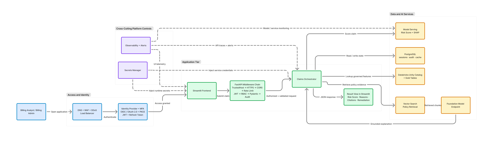

## Project: AI-Powered Claim Denial Prevention & Remediation System

## 1\. Problem Understanding

In real life: Doctor treats patient → Billing team creates claim → Insurance may approve or deny

**The Problem:** Many claims get denied because of:

- Missing data
- Wrong codes
- Incorrect billing

**This causes:**

- Delay in payment
- Extra rework ($14 per claim to rework)
- Revenue loss (healthcare loses $262 billion/year to denied claims)

## 2\. Primary User

**Billing Analyst** — the person this system is built for.

| Attribute        | Detail                                                                    |
| :--------------- | :------------------------------------------------------------------------ |
| Role             | Medical billing professional                                              |
| Domain expertise | ICD-10 codes, CPT codes, insurance requirements                           |
| Goal             | Submit clean claims on first pass, avoid denials                          |
| Pain point       | Too many claims to audit manually; policy documents are hundreds of pages |

##

## 3\. System Architecture

### 3.1 Overall System Architecture

Context only — shows the full end-state system. Bronze layer inside Databricks.

###

### 3.2 Medallion Data Architecture

Shows the full data layer. **Bronze layer only.**

###

### 3.3 Ingestion Flow

![flowchart TD    CSV["CSV Files Landing Zone (cloud storage path — decided at implementation)"] -->|"read_files() function CSV format · incremental only"| SDP["Lakeflow Spark Declarative Pipeline Streaming Table definition Checkpoint + schema state managed by SDP"]    SDP -->|"Append-only write"| BT["Bronze Delta Table healthcare.bronze.claims Raw data preserved as-is"]    BT --> UC["Unity Catalog Governance · RBAC · Lineage · Data Lineage"]][image1]

## 4\. Technology Stack

| Component            | Choice                                         | Why This Choice                                                                                                                                                                                                                                                                                               |
| :------------------- | :--------------------------------------------- | :------------------------------------------------------------------------------------------------------------------------------------------------------------------------------------------------------------------------------------------------------------------------------------------------------------ |
| Data Platform        | **Databricks**                                 | Unified ETL \+ ML \+ governance on a single platform. Native Delta Lake. HIPAA controls and BAA support available with required compliance configuration.                                                                                                                                                     |
| Storage Format       | **Delta Lake**                                 | ACID transactions (no partial writes), time-travel for HIPAA audit, Change Data Feed for incremental reads, schema evolution without pipeline failure.                                                                                                                                                        |
| ETL Orchestration    | **Lakeflow Spark Declarative Pipelines (SDP)** | Databricks' modern, production-grade ETL framework. Replaces manual notebook-based Auto Loader. Manages checkpointing, schema evolution, and incremental state automatically. Pipeline code lives in plain `.sql` or `.py` files — not notebooks — enabling version control and CI/CD. Serverless by default. |
| Ingestion Function   | **`read_files()` via SDP**                     | SDP's `read_files()` function uses Auto Loader under the hood but abstracts away manual configuration of checkpoint paths, schema locations, and streaming setup. CSV is a supported format.                                                                                                                  |
| Catalog & Governance | **Unity Catalog**                              | Centralized RBAC at row/column level. Automatic data lineage tracking from source to Gold. Required for serverless SDP pipelines. Meets HIPAA audit requirement natively.                                                                                                                                     |

## 5\. Input Datasets

| Dataset   | File                 | Key Columns                                                                            | Purpose                         |
| :-------- | :------------------- | :------------------------------------------------------------------------------------- | :------------------------------ |
| Claims    | `claims_1000.csv`    | claim_id, patient_id, provider_id, diagnosis_code, procedure_code, billed_amount, date | Primary dataset — 1,000 records |
| Providers | `providers_1000.csv` | provider_id, doctor_name, specialty, location                                          | Who created the claim           |
| Diagnosis | `diagnosis.csv`      | diagnosis_code, category, severity                                                     | Medical reason for claim        |
| Cost      | `cost.csv`           | procedure_code, average_cost, expected_cost, region                                    | Detect overbilling vs benchmark |

### Known Data Quality Issues

| Issue                     | Column                | Impact                                               |
| :------------------------ | :-------------------- | :--------------------------------------------------- |
| Missing procedure_code    | claims.procedure_code | Automatic denial — incomplete claim                  |
| Missing billed_amount     | claims.billed_amount  | Unprocessable claim                                  |
| Missing provider location | providers.location    | Administrative rejection                             |
| No approved/denied label  | claims table          | Must derive proxy label later using rule-based logic |

## 6\. HIPAA & Security Baseline

### 6.1 Data Handling

**All development data is synthetic/anonymized.** No real PHI is used in this environment. Production deployment requires a signed Databricks BAA before any real PHI is ingested.

### 6.2 Data Classification

| Column                                       | Classification      | Handling                                  |
| :------------------------------------------- | :------------------ | :---------------------------------------- |
| patient_id                                   | PHI                 | Encrypted at rest (AES-256 in production) |
| billed_amount                                | PHI                 | Encrypted at rest                         |
| diagnosis_code                               | PHI                 | Encrypted at rest                         |
| claim_id                                     | PHI-adjacent        | Standard storage, access controlled       |
| provider_id                                  | Operational         | Standard storage                          |
| Audit columns (\_ingested_at, \_source_file) | Compliance metadata | Append-only, never deleted                |

### 6.3 HIPAA Bronze Table Properties

Every Bronze Delta table must have the following properties set at creation — **not retroactively**:

| Property                           | Value            | Reason                                                                                                                                                                                                                                                                                                                                    |
| :--------------------------------- | :--------------- | :---------------------------------------------------------------------------------------------------------------------------------------------------------------------------------------------------------------------------------------------------------------------------------------------------------------------------------------- |
| delta.enableChangeDataFeed         | true             | Enables incremental reads so downstream layers process only new records — without this, every run re-processes the entire table                                                                                                                                                                                                           |
| delta.logRetentionDuration         | interval 6 years | Organization retention policy for audit reconstruction. §164.316(b)(2)(i) mandates 6-year retention for HIPAA compliance documentation and audit records; keeping Bronze data for 6 years ensures the technical audit trail can support those records. Raw data table retention is also governed by applicable state medical records law. |
| delta.deletedFileRetentionDuration | interval 6 years | Retains physical files even after logical deletion, supporting full time-travel for compliance investigations                                                                                                                                                                                                                             |

###

### 6.4 Unity Catalog Access Control

Apply least-privilege access from day one on all five Bronze tables:

| Principal                     | Permission  | Reason                                      |
| :---------------------------- | :---------- | :------------------------------------------ |
| ETL ingestion Service Account | INSERT only | Pipeline writes data; cannot read or delete |
| Billing analyst role/group    | SELECT only | Analysts can query; cannot modify raw data  |
| public                        | No access   | Default-deny for all other principals       |

### 6.5 Secrets Management

Storage credentials for the landing zone must be stored in Databricks Secrets — never hardcoded in notebooks or configuration files. Any credentials found hardcoded in a notebook are a HIPAA security violation and must be rotated immediately.

---

## 7\. Non-Functional Requirements (Reference)

The Bronze layer must not constrain these system-level targets:

| ID           | Requirement                           | Target                                 |
| :----------- | :------------------------------------ | :------------------------------------- |
| NFR-PERF-01  | Single-claim validation latency (p95) | \< 2 seconds                           |
| NFR-PERF-05  | ML model inference (p95)              | \< 150ms                               |
| NFR-PERF-06  | RAG retrieval \+ explanation (p95)    | \< 5 seconds                           |
| NFR-REL-01   | System availability                   | 99.9%                                  |
| NFR-COMP-02  | Audit log retention                   | Minimum 6 years, immutable             |
| NFR-SCALE-01 | Claims throughput                     | 10,000/day initial, scalable to 1M/day |

## 8\. Cost Estimation

**Cloud:** AWS (us-east-1 region) **Databricks Tier:** Premium — required for HIPAA compliance controls, Unity Catalog enterprise governance, and audit logging. Standard tier does not cover these requirements.  
Prices are AWS and Databricks public list prices researched April 2026\. Enterprise agreements typically carry 20–40% negotiated discounts..

### 8.1 Usage Assumptions

All cost estimates below are derived from these assumptions. Changing one assumption scales the cost proportionally.

| Parameter                                  | Staging                                | Production               | Basis                                      |
| :----------------------------------------- | :------------------------------------- | :----------------------- | :----------------------------------------- |
| Claims processed per day                   | 1,000                                  | 10,000                   | NFR-SCALE-01: 10,000/day initial target    |
| Claims processed per month                 | 30,000                                 | 300,000                  | 30 working days                            |
| HIGH-risk claims receiving LLM explanation | 15,000/month                           | 150,000/month            | Assumed 50% of claims flagged HIGH risk    |
| Avg. tokens per LLM call                   | 800 input / 500 output                 | 800 input / 500 output   | System prompt \+ 5 retrieved policy chunks |
| Concurrent analyst users                   | 2                                      | 10                       | Billing team size                          |
| Policy document corpus                     | \~500 chunks (768-dim)                 | \~500 chunks             | \~50 insurance policy PDFs                 |
| Delta Lake storage growth                  | \~15 MB/month                          | \~150 MB/month           | 300K claims/month × \~500 bytes/record     |
| Audit log rows inserted/month              | 30,000                                 | 300,000                  | 1 audit event per claim \+ admin activity  |
| ETL job runtime per day                    | 30 min                                 | 60 min                   | Daily batch processing window              |
| ML model serving                           | 1 CPU replica, scale-to-zero overnight | 1 CPU replica, always-on | XGBoost inference — no GPU required        |

### 8.2 Unit Pricing Reference (Only Indicative)

| Component                                   | Unit Price                                         | Source                                                             |
| :------------------------------------------ | :------------------------------------------------- | :----------------------------------------------------------------- |
| Databricks Premium — Jobs Compute, AWS      | \~$0.37/DBU \+ EC2 cost                            | Databricks public pricing, Premium tier                            |
| Databricks Vector Search Standard, AWS      | $0.07/DBU · 4 DBU/unit/hour \= **$0.28/unit/hour** | Confirmed: Databricks Vector Search pricing page (April 2026\)     |
| Foundation Model API — Meta Llama 3.3 70B   | $0.90/M input tokens · $2.70/M output tokens       | Databricks Foundation Model API pricing (approximate, April 2026\) |
| Foundation Model API — GTE Large embeddings | $0.10/M tokens                                     | Databricks Foundation Model API pricing                            |
| AWS EC2 r5.xlarge on-demand (us-east-1)     | $0.252/hour                                        | AWS EC2 pricing                                                    |
| AWS EC2 r5.xlarge spot (us-east-1)          | \~$0.08/hour                                       | AWS Spot pricing (varies)                                          |
| AWS RDS PostgreSQL db.t3.medium (us-east-1) | \~$0.068/hour                                      | AWS RDS pricing                                                    |
| AWS RDS PostgreSQL db.r6g.large (us-east-1) | \~$0.192/hour                                      | AWS RDS pricing                                                    |
| AWS RDS gp3 storage                         | $0.115/GB-month                                    | AWS RDS pricing                                                    |
| AWS S3 Standard (us-east-1, first 50 TB)    | $0.023/GB-month                                    | AWS S3 pricing                                                     |

### 8.3 Staging Cost Breakdown

**Basis:** 1,000 claims/day · 30,000 claims/month · 15,000 LLM calls/month

| Component                         | Calculation                                                                                                                            | Est./Month       |
| :-------------------------------- | :------------------------------------------------------------------------------------------------------------------------------------- | :--------------- |
| Databricks ETL (Jobs Compute)     | 2-node r5.xlarge cluster · 30 min/day · 30 days \= 15 hrs. DBU: 4 DBU/hr × $0.37 × 15 \= $22. EC2 spot: 2 × $0.08 × 15 \= $2.40        | \~$25            |
| Databricks Model Serving (CPU)    | 1 small CPU replica · scale-to-zero overnight (12 hrs active/day) · \~2 DBU/hr × $0.07 × 360 hrs                                       | \~$50            |
| Databricks Vector Search          | 1 Standard unit × 4 DBU/hr × $0.07/DBU × 720 hrs/month \= $201.60                                                                      | \~$202           |
| Foundation Model API — LLM        | 15,000 calls × 800 input tokens \= 12M tokens × $0.90/M \= $10.80 input. 15,000 × 500 output \= 7.5M tokens × $2.70/M \= $20.25 output | \~$31            |
| Foundation Model API — Embeddings | Initial indexing only: 500 chunks × 200 tokens \= 100K tokens × $0.10/M \= $0.01 (one-time, negligible)                                | \~$0             |
| AWS RDS PostgreSQL (db.t3.medium) | $0.068/hr × 720 hrs \= $49. Storage: 1 GB × $0.115 \= $0.12                                                                            | \~$50            |
| AWS S3 (Delta Lake)               | \~1 GB total staging data × $0.023 \+ request costs                                                                                    | \~$5             |
| App Hosting (2× EC2 t3.small)     | FastAPI \+ Streamlit · 2 × \~$15/month                                                                                                 | \~$30            |
| Networking \+ monitoring          | VPC, CloudWatch, basic WAF                                                                                                             | \~$50            |
| **Staging Total**                 |                                                                                                                                        | **\~$443/month** |

### 8.4 Production Cost Breakdown

**Basis:** 10,000 claims/day · 300,000 claims/month · 150,000 LLM calls/month

| Component                              | Calculation                                                                                                                     | Est./Month                |
| :------------------------------------- | :------------------------------------------------------------------------------------------------------------------------------ | :------------------------ |
| Databricks ETL (Jobs Compute)          | 2-node r5.xlarge cluster · 60 min/day · 30 days \= 30 hrs. DBU: 4 DBU/hr × $0.37 × 30 \= $44. EC2 spot: 2 × $0.08 × 30 \= $4.80 | \~$50                     |
| Databricks Model Serving (CPU)         | 1 CPU replica always-on · auto-scale under load. \~300K predictions/month at \<150ms each                                       | \~$150–$250               |
| Databricks Vector Search               | 1 Standard unit × 4 DBU/hr × $0.07/DBU × 720 hrs/month \= $201.60                                                               | \~$202                    |
| Foundation Model API — LLM             | 150,000 calls × 800 input \= 120M tokens × $0.90/M \= $108 input. 150,000 × 500 output \= 75M × $2.70/M \= $202.50 output       | \~$311                    |
| AWS RDS PostgreSQL (db.r6g.large)      | $0.192/hr × 720 hrs \= $138. Storage: 5 GB × $0.115 \= $0.58. Multi-AZ read replica for HA                                      | \~$175                    |
| AWS S3 (Delta Lake)                    | \~5 GB after 3 months × $0.023 \+ \~1M PUT requests/month × $0.005/1K \= $5                                                     | \~$20                     |
| App Hosting (EC2 t3.medium × 2 \+ ALB) | FastAPI \+ Streamlit · load-balanced                                                                                            | \~$100                    |
| Networking \+ compliance               | AWS PrivateLink ($50) · CloudWatch ($40) · WAF ($25) · Secrets Manager ($5)                                                     | \~$120                    |
| **Production Total**                   |                                                                                                                                 | **\~$1,128–$1,228/month** |

**Largest fixed cost: Vector Search at \~$202/month regardless of claim volume.**

### 8.5 Cost Optimization Strategies

| Strategy                                | Saving                               | Approach                                                                    |
| :-------------------------------------- | :----------------------------------- | :-------------------------------------------------------------------------- |
| Spot instances for ETL clusters         | \~70% on EC2 compute                 | ETL jobs tolerate interruption; Auto Loader checkpoint ensures safe restart |
| Job clusters over all-purpose clusters  | 30–40% DBU saving                    | Clusters auto-terminate after job — no idle billing                         |
| Scale-to-zero on staging model endpoint | Eliminates \~12 hrs/day serving cost | Enable in staging; keep always-on in production only                        |
| LLM explanation caching                 | Avoids repeated FM calls             | Cache output by denial-reason hash — same rule flag \= same explanation     |
| Use Llama 3.3 70B over Llama 3.1 405B   | \~5× cheaper per token               | 70B is sufficient for structured billing explanations                       |
| Triggered Vector Search sync only       | Removes continuous indexing cost     | Rebuild index only when policy corpus is updated                            |

## 9\. Process

### Step 1: Create Unity Catalog Namespace

Create the catalog and schema in Databricks Unity Catalog before any tables are written:

- Catalog name: `healthcare`
- Schema name: `healthcare.bronze`

### Step 2: Load Raw Data with Auto Loader

Each dataset gets its own SDP streaming table definition using the `read_files()` function, which uses Auto Loader under the hood. Auto Loader officially supports CSV (`format => 'csv'` is an explicitly listed allowed value alongside json, parquet, avro, orc, text, and binaryFile — confirmed from Databricks Auto Loader options docs).

SDP manages checkpoint state and schema location automatically — these do not need to be configured manually. The required `read_files()` parameters are:

| Parameter           | Value         | Reason                                                                                                                              |
| :------------------ | :------------ | :---------------------------------------------------------------------------------------------------------------------------------- |
| format              | csv           | Declares the source file type — required, no default                                                                                |
| header              | true          | **CSV-specific — defaults to false.** All four datasets have header rows; without this, the header row is ingested as a data record |
| inferColumnTypes    | true          | Infers exact column types (integer, date, float) — use this SDP parameter, not the generic `inferSchema` option                     |
| schemaEvolutionMode | addNewColumns | Tolerates new columns in source files without failing the pipeline                                                                  |

Audit columns to add to every Bronze streaming table:

| Column             | Value                                                     | Purpose                                                                                                                                  |
| :----------------- | :-------------------------------------------------------- | :--------------------------------------------------------------------------------------------------------------------------------------- |
| `_ingested_at`     | `current_timestamp()`                                     | HIPAA: records exactly when data entered the system                                                                                      |
| `_source_file`     | `_metadata.file_path`                                     | Data lineage: which file the record came from. Use `_metadata.file_path` — `input_file_name()` is a legacy function not supported in SDP |
| `_pipeline_run_id` | Injected at runtime (mechanism decided at implementation) | Links each row to the pipeline execution that created it                                                                                 |

Create one pipeline file per dataset: claims, providers, diagnosis, cost, and policies. The first four use `cloudFiles.format=csv` with the parameters above. The policies pipeline uses `cloudFiles.format=binaryFile` with `pathGlobFilter=*.pdf` — the binaryFile schema is fixed (path, modificationTime, length, content), so inferColumnTypes and schemaEvolutionMode do not apply.

###

### Step 3: Verify Bronze Table Properties

In SDP, TBLPROPERTIES are declared **inside** the `CREATE OR REFRESH STREAMING TABLE` definition in the pipeline file itself — they are not applied as a separate `ALTER TABLE` step after creation. This keeps configuration declarative and version-controlled within the DAB, and aligns with Section 7.3's requirement that properties be set at creation, not retroactively.

After the pipeline runs for the first time, verify the HIPAA and CDF properties from Section 7.3 are correctly applied by running `DESCRIBE EXTENDED` on each of the five Bronze tables.

### Step 4: Apply Access Control

Apply the Unity Catalog RBAC grants defined in Section 7.4 to all five Bronze tables.

### Step 5: Data Profiling

Run profiling on all five Bronze tables using PySpark (not pandas — these are Spark DataFrames). Profiling must cover:

| Check                  | What to Measure                                                 |
| :--------------------- | :-------------------------------------------------------------- |
| Row count              | Total rows; must match source CSV                               |
| Null values            | Count and percentage per column                                 |
| Duplicate primary keys | Duplicate claim_id values in claims table                       |
| Summary statistics     | Min, max, average, p95 for billed_amount                        |
| Referential integrity  | All provider_id values in claims must exist in providers table  |
| Anomalous amounts      | Any billed_amount values significantly above regional benchmark |

### Questions to Answer from Profiling

- Is `claim_id` unique across all 1,000 records?
- What percentage of claims have a missing `procedure_code`?
- What percentage of claims have a missing `billed_amount`?
- Are all `provider_id` values in the claims table present in the providers table?
- What is the maximum `billed_amount`? Does it appear anomalous?
- How many providers have a missing `location`?

## 10\. Testing & Exit Criteria

| Check                    | How to Verify                                        | Pass Criteria                                             |
| :----------------------- | :--------------------------------------------------- | :-------------------------------------------------------- |
| Row count match          | Compare table row count vs source CSV line count     | 100% match, no data loss                                  |
| Idempotent re-run        | Re-run the SDP pipeline a second time on same files  | Checkpoint prevents reprocessing already ingested files   |
| TBLPROPERTIES set        | Run DESCRIBE EXTENDED on each Bronze table           | CDF enabled and 6-year retention visible on all 4 tables  |
| Audit columns present    | Query each table and inspect first row               | \_ingested_at and \_source_file are populated on all rows |
| RBAC applied             | Attempt a SELECT and INSERT with analyst credentials | SELECT succeeds; INSERT is denied                         |
| No hardcoded credentials | Manual review of all notebooks                       | Zero plaintext credentials in any cell                    |
| Profiling complete       | Review profiling notebook outputs                    | All 6 profiling questions answered for all 4 tables       |

## 11\. Risk Register

| Risk                                      | Likelihood | Impact | Mitigation                                                                                                                                                                                                                                                                                                                                                                                  |
| :---------------------------------------- | :--------- | :----- | :------------------------------------------------------------------------------------------------------------------------------------------------------------------------------------------------------------------------------------------------------------------------------------------------------------------------------------------------------------------------------------------ |
| CSV schema changes (new column added)     | Low        | Medium | cloudFiles.schemaEvolutionMode set to addNewColumns handles this automatically                                                                                                                                                                                                                                                                                                              |
| Storage credentials expire                | Low        | High   | Store in Databricks Secrets with rotation policy                                                                                                                                                                                                                                                                                                                                            |
| Auto Loader checkpoint corrupted          | Low        | Medium | Run `databricks pipelines reset --pipeline-id <id>` — this clears both the checkpoint AND the table data, then re-ingests from source. Do NOT delete only the checkpoint folder: Auto Loader will reprocess all files and write duplicate rows into the append-only Bronze table. Silver's MERGE dedup on `claim_id` provides a downstream safety net, but Bronze integrity is compromised. |
| Row count mismatch between CSV and Bronze | Medium     | High   | Compare table count vs source file line count; investigate before proceeding                                                                                                                                                                                                                                                                                                                |

