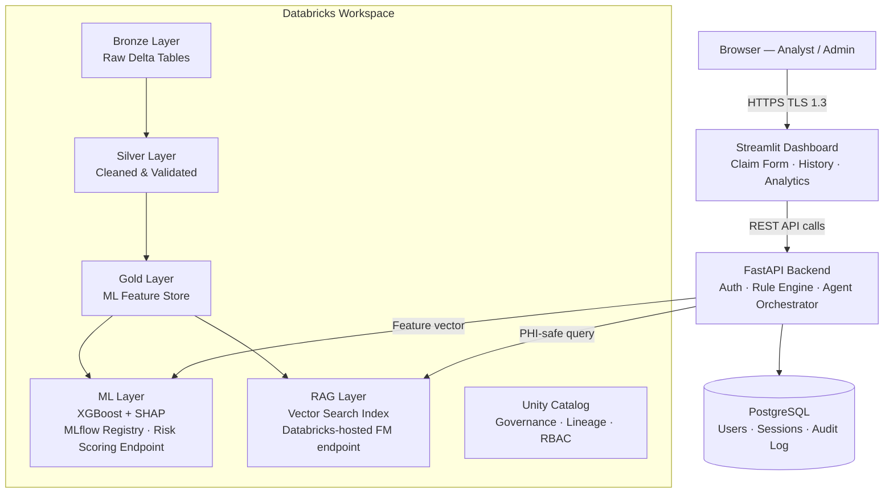
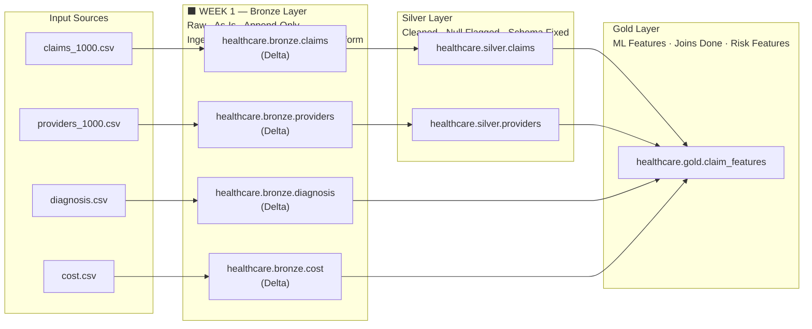
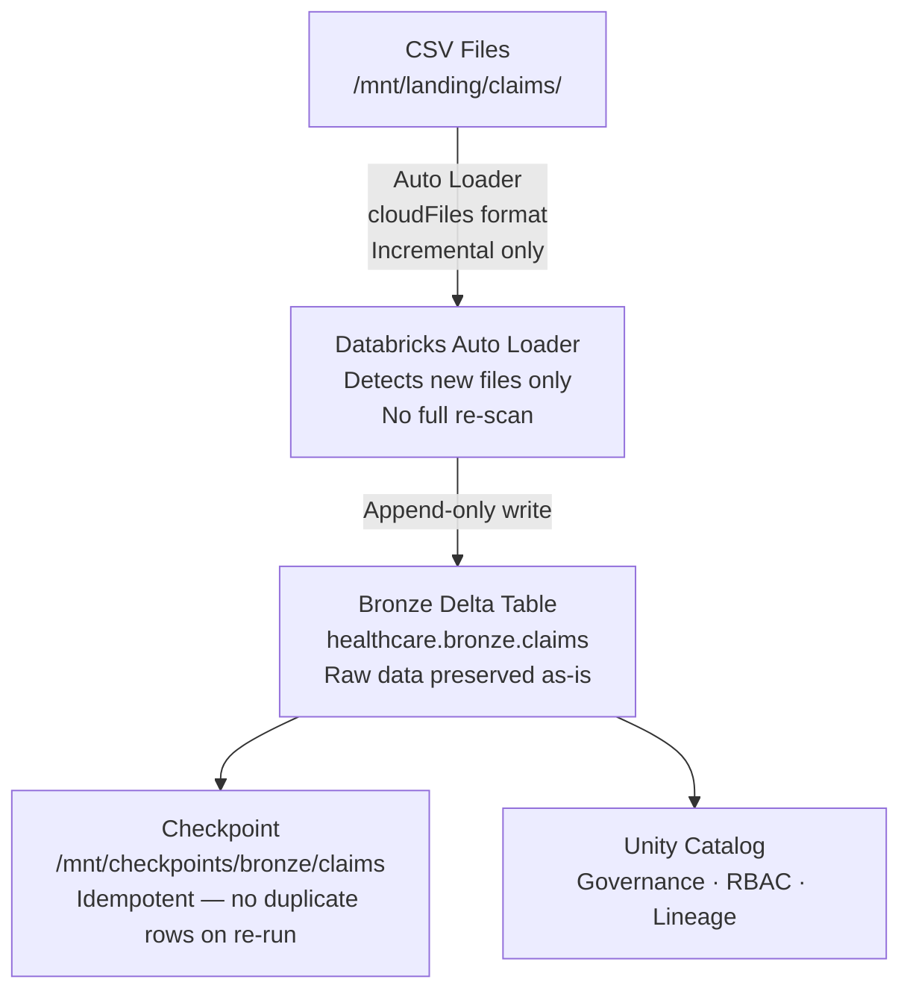

# WEEK 1 – PRODUCT DOCUMENT

## Project: AI-Powered Claim Denial Prevention & Remediation System

---

## 1. Problem Understanding

In real life: Doctor treats patient → Billing team creates claim → Insurance may approve or deny

**The Problem:** Many claims get denied because of:

- Missing data
- Wrong codes
- Incorrect billing

**This causes:**

- Delay in payment
- Extra rework ($14 per claim to rework)
- Revenue loss (healthcare loses $262 billion/year to denied claims)

---

## 2. Primary User

**Billing Analyst** — the person this system is built for.

| Attribute        | Detail                                                                    |
| ---------------- | ------------------------------------------------------------------------- |
| Role             | Medical billing professional                                              |
| Domain expertise | ICD-10 codes, CPT codes, insurance requirements                           |
| Goal             | Submit clean claims on first pass, avoid denials                          |
| Pain point       | Too many claims to audit manually; policy documents are hundreds of pages |

---

## 3. System Architecture

### 3.1 Overall System Architecture

> Context only — shows the full end-state system. Week 1 builds the Bronze layer inside Databricks.

### 3.2 Medallion Data Architecture

> Shows the full data layer. **Week 1 scope = Bronze layer only.**

### 3.3 Week 1 Ingestion Flow

---

## 4. Week 1 Scope

| In Scope                                  | Out of Scope                  |
| ----------------------------------------- | ----------------------------- |
| Understand the problem                    | ML model                      |
| Identify and load datasets                | RAG / Vector Search           |
| Create Bronze Delta tables                | Agent orchestration           |
| Enable audit columns and Change Data Feed | FastAPI / Streamlit           |
| Basic data profiling                      | Any AI features               |
| Unity Catalog RBAC setup                  | Cleaning or transforming data |
| HIPAA Bronze table properties             | Silver / Gold layers          |

---

## 5. Technology Stack — Week 1

| Component            | Choice                       | Why This Choice                                                                                                                                         |
| -------------------- | ---------------------------- | ------------------------------------------------------------------------------------------------------------------------------------------------------- |
| Data Platform        | **Databricks**               | Unified ETL + ML + governance on a single platform. Native Delta Lake. HIPAA controls and BAA support available with required compliance configuration. |
| Storage Format       | **Delta Lake**               | ACID transactions (no partial writes), time-travel for HIPAA audit, Change Data Feed for incremental reads, schema evolution without pipeline failure.  |
| Ingestion Pattern    | **Auto Loader (cloudFiles)** | Processes only new files incrementally — no expensive full re-scan on every run. Handles schema evolution automatically.                                |
| Catalog & Governance | **Unity Catalog**            | Centralized RBAC at row/column level. Automatic data lineage tracking from source to Gold. Meets HIPAA audit requirement natively.                      |

---

## 6. Input Datasets

| Dataset   | File                 | Key Columns                                                                            | Purpose                         |
| --------- | -------------------- | -------------------------------------------------------------------------------------- | ------------------------------- |
| Claims    | `claims_1000.csv`    | claim_id, patient_id, provider_id, diagnosis_code, procedure_code, billed_amount, date | Primary dataset — 1,000 records |
| Providers | `providers_1000.csv` | provider_id, doctor_name, specialty, location                                          | Who created the claim           |
| Diagnosis | `diagnosis.csv`      | diagnosis_code, category, severity                                                     | Medical reason for claim        |
| Cost      | `cost.csv`           | procedure_code, average_cost, expected_cost, region                                    | Detect overbilling vs benchmark |

### Known Data Quality Issues

| Issue                     | Column                | Impact                                               |
| ------------------------- | --------------------- | ---------------------------------------------------- |
| Missing procedure_code    | claims.procedure_code | Automatic denial — incomplete claim                  |
| Missing billed_amount     | claims.billed_amount  | Unprocessable claim                                  |
| Missing provider location | providers.location    | Administrative rejection                             |
| No approved/denied label  | claims table          | Must derive proxy label later using rule-based logic |

---

## 7. HIPAA & Security Baseline

### 7.1 Data Handling

> **All development data is synthetic/anonymized.** No real PHI is used in this environment. Production deployment requires a signed Databricks BAA before any real PHI is ingested.

### 7.2 Data Classification

| Column                                       | Classification      | Handling                                  |
| -------------------------------------------- | ------------------- | ----------------------------------------- |
| patient_id                                   | PHI                 | Encrypted at rest (AES-256 in production) |
| billed_amount                                | PHI                 | Encrypted at rest                         |
| diagnosis_code                               | PHI                 | Encrypted at rest                         |
| claim_id                                     | PHI-adjacent        | Standard storage, access controlled       |
| provider_id                                  | Operational         | Standard storage                          |
| Audit columns (\_ingested_at, \_source_file) | Compliance metadata | Append-only, never deleted                |

### 7.3 HIPAA Bronze Table Properties

Every Bronze Delta table must have the following properties set at creation — **not retroactively**:

| Property                           | Value            | Reason                                                                                                                          |
| ---------------------------------- | ---------------- | ------------------------------------------------------------------------------------------------------------------------------- |
| delta.enableChangeDataFeed         | true             | Enables incremental reads so downstream layers process only new records — without this, every run re-processes the entire table |
| delta.logRetentionDuration         | interval 6 years | HIPAA requires 6-year retention under 45 CFR § 164.316(b)(2)(i) — Bronze is the source-of-truth for audit reconstruction        |
| delta.deletedFileRetentionDuration | interval 6 years | Retains physical files even after logical deletion, supporting full time-travel for compliance investigations                   |

### 7.4 Unity Catalog Access Control

Apply least-privilege access from day one on all four Bronze tables:

| Principal                 | Permission  | Reason                                      |
| ------------------------- | ----------- | ------------------------------------------- |
| ingestion_service_account | INSERT only | Pipeline writes data; cannot read or delete |
| billing_analyst role      | SELECT only | Analysts can query; cannot modify raw data  |
| public                    | No access   | Default-deny for all other principals       |

### 7.5 Secrets Management

Storage credentials for the landing zone must be stored in Databricks Secrets — never hardcoded in notebooks or configuration files. Any credentials found hardcoded in a notebook are a HIPAA security violation and must be rotated immediately.

---

## 8. Non-Functional Requirements (Reference)

The Bronze layer must not constrain these system-level targets:

| ID           | Requirement                           | Target                                 |
| ------------ | ------------------------------------- | -------------------------------------- |
| NFR-PERF-01  | Single-claim validation latency (p95) | < 2 seconds                            |
| NFR-PERF-05  | ML model inference (p95)              | < 150ms                                |
| NFR-PERF-06  | RAG retrieval + explanation (p95)     | < 5 seconds                            |
| NFR-REL-01   | System availability                   | 99.9%                                  |
| NFR-COMP-02  | Audit log retention                   | Minimum 6 years, immutable             |
| NFR-SCALE-01 | Claims throughput                     | 10,000/day initial, scalable to 1M/day |

> Auto Loader's incremental-only design is the Bronze layer's direct contribution to NFR-SCALE-01. A full re-scan ingestion pattern would bottleneck throughput at scale.

---

## 9. Cost Estimation — Development Environment

| Component          | Service                                 | Estimated Cost/Month |
| ------------------ | --------------------------------------- | -------------------- |
| Databricks         | Free Edition or trial                   | ~$0–$25              |
| Delta Lake storage | Minimal dev data (4 small CSVs)         | ~$0–$5               |
| Unity Catalog      | Included in all Databricks editions     | $0                   |
| **Dev Total**      | Synthetic data only, not HIPAA-eligible | **~$0–$30/month**    |

### Cost Optimization for Bronze Layer

| Strategy                                     | Saving                                           | Approach                                               |
| -------------------------------------------- | ------------------------------------------------ | ------------------------------------------------------ |
| Auto Loader vs full CSV re-scan              | Avoids reprocessing entire dataset on every run  | Use cloudFiles incremental format                      |
| Job clusters instead of all-purpose clusters | 30–40% compute saving                            | Clusters auto-terminate after the job; no idle billing |
| Checkpoint location                          | Prevents duplicate processing and wasted compute | Set checkpoint path before first run                   |

---

## 10. Process — What You Will Do

### Step 1: Create Project Structure

Organize notebooks into four folders:

| Folder           | Purpose                                        |
| ---------------- | ---------------------------------------------- |
| 01_ingestion     | Auto Loader notebooks — one per dataset        |
| 02_bronze_tables | Table creation and TBLPROPERTIES configuration |
| 03_profiling     | Data quality analysis notebooks                |
| 04_docs          | Architecture draft and problem document        |

### Step 2: Create Unity Catalog Namespace

Create the catalog and schema in Databricks Unity Catalog before any tables are written:

- Catalog name: `healthcare`
- Schema name: `healthcare.bronze`

### Step 3: Load Raw Data with Auto Loader

Use **Auto Loader** (cloudFiles incremental format) — not a batch CSV read. The batch approach re-processes the entire file on every run, which is not production-grade.

Auto Loader officially supports CSV via `cloudFiles.format = "csv"` (confirmed: Databricks Auto Loader options docs list csv as an allowed value alongside json, parquet, avro, orc, text, binaryFile, and xml).

Auto Loader configuration requirements:

| Configuration                  | Value                           | Reason                                                                                                                                                                                 |
| ------------------------------ | ------------------------------- | -------------------------------------------------------------------------------------------------------------------------------------------------------------------------------------- |
| Format                         | cloudFiles                      | Enables incremental file detection — only new files processed per run                                                                                                                  |
| cloudFiles.format              | csv                             | Declares the source file type; required, no default                                                                                                                                    |
| header                         | true                            | **CSV-specific — defaults to false.** All four source datasets have header rows; without this, the header row is ingested as a data record                                             |
| cloudFiles.inferColumnTypes    | true                            | Infers exact column types (integer, date, float) rather than defaulting everything to string. Use this option for Auto Loader — not the generic `inferSchema` option                   |
| cloudFiles.schemaLocation      | /mnt/schema/bronze/{table}      | **Required for schema inference.** Auto Loader persists the inferred schema here so it does not re-infer on every run. Without this, schema inference runs from scratch each execution |
| cloudFiles.schemaEvolutionMode | addNewColumns                   | Tolerates new fields in source files without failing the pipeline                                                                                                                      |
| Output mode                    | append                          | Bronze is append-only — never overwrite raw data                                                                                                                                       |
| Checkpoint location            | /mnt/checkpoints/bronze/{table} | Tracks which files have been processed; ensures idempotency across re-runs                                                                                                             |
| mergeSchema                    | true                            | Accepts schema additions to the Delta table without error                                                                                                                              |

Audit columns to add to every Bronze table at ingestion time:

| Column            | Value             | Purpose                                                  |
| ----------------- | ----------------- | -------------------------------------------------------- |
| \_ingested_at     | Current timestamp | HIPAA: records exactly when data entered the system      |
| \_source_file     | Input file name   | Data lineage: which file the record came from            |
| \_pipeline_run_id | Runtime parameter | Links each row to the pipeline execution that created it |

Repeat the ingestion notebook for all four datasets: claims, providers, diagnosis, cost.

### Step 4: Set Bronze Table Properties

Immediately after table creation, configure the HIPAA and CDF properties defined in Section 7.3 on all four Bronze tables.

### Step 5: Apply Access Control

Apply the Unity Catalog RBAC grants defined in Section 7.4 to all four Bronze tables.

### Step 6: Data Profiling

Run profiling on all four Bronze tables using PySpark (not pandas — these are Spark DataFrames). Profiling must cover:

| Check                  | What to Measure                                                 |
| ---------------------- | --------------------------------------------------------------- |
| Row count              | Total rows; must match source CSV                               |
| Null values            | Count and percentage per column                                 |
| Duplicate primary keys | Duplicate claim_id values in claims table                       |
| Summary statistics     | Min, max, average, p95 for billed_amount                        |
| Referential integrity  | All provider_id values in claims must exist in providers table  |
| Anomalous amounts      | Any billed_amount values significantly above regional benchmark |

### Questions to Answer from Profiling

- Is `claim_id` unique across all 1,000 records?
- What percentage of claims have a missing `procedure_code`?
- What percentage of claims have a missing `billed_amount`?
- Are all `provider_id` values in the claims table present in the providers table?
- What is the maximum `billed_amount`? Does it appear anomalous?
- How many providers have a missing `location`?

---

## 11. Deliverables

### Output 1: Problem Document

- What is the problem
- Who is the primary user (Billing Analyst)
- What the system will do

### Output 2: Dataset Summary Table

| Dataset   | Rows    | Key Issue Found                                    |
| --------- | ------- | -------------------------------------------------- |
| Claims    | 1,000   | Missing procedure_code, missing billed_amount      |
| Providers | TBD     | Missing location for some providers                |
| Diagnosis | 6 codes | D10–D60 (Heart, Bone, Fever, Skin, Diabetes, Cold) |
| Cost      | TBD     | Regional benchmarks available                      |

### Output 3: Bronze Delta Tables

All four tables created in Unity Catalog with correct TBLPROPERTIES applied:

- `healthcare.bronze.claims`
- `healthcare.bronze.providers`
- `healthcare.bronze.diagnosis`
- `healthcare.bronze.cost`

Each table must have: `_ingested_at`, `_source_file`, `_pipeline_run_id` audit columns; Change Data Feed enabled; 6-year log retention set.

### Output 4: Profiling Report

Document the following findings per table:

- Percentage of claims with missing `procedure_code`
- Percentage of claims with missing `billed_amount`
- Duplicate claim IDs found: yes / no
- Providers with missing location: count
- Billed amount anomalies: max value, p95 value

### Output 5: Architecture Draft

The three architecture diagrams in Section 3 serve as the architecture deliverable. Confirm Bronze tables are visible in Unity Catalog data lineage.

---

## 12. Testing & Exit Criteria

| Check                    | How to Verify                                        | Pass Criteria                                             |
| ------------------------ | ---------------------------------------------------- | --------------------------------------------------------- |
| Row count match          | Compare table row count vs source CSV line count     | 100% match, no data loss                                  |
| Idempotent re-run        | Trigger Auto Loader twice on the same file           | Checkpoint prevents duplicate rows                        |
| TBLPROPERTIES set        | Run DESCRIBE EXTENDED on each Bronze table           | CDF enabled and 6-year retention visible on all 4 tables  |
| Audit columns present    | Query each table and inspect first row               | \_ingested_at and \_source_file are populated on all rows |
| RBAC applied             | Attempt a SELECT and INSERT with analyst credentials | SELECT succeeds; INSERT is denied                         |
| No hardcoded credentials | Manual review of all notebooks                       | Zero plaintext credentials in any cell                    |
| Profiling complete       | Review profiling notebook outputs                    | All 6 profiling questions answered for all 4 tables       |

---

## 13. Common Mistakes

| Mistake                                                        | Why It Is Wrong                                                                                                            |
| -------------------------------------------------------------- | -------------------------------------------------------------------------------------------------------------------------- |
| Using batch CSV read instead of Auto Loader                    | Batch read re-processes the entire dataset on every run — not incremental, not production-grade                            |
| Not setting header = true for CSV                              | Auto Loader defaults header to false — the header row is ingested as a data record, corrupting row counts and column names |
| Omitting cloudFiles.schemaLocation                             | Without a schema location, Auto Loader re-infers the schema from scratch on every run — slow and unstable in production    |
| Using pandas syntax in Databricks notebooks                    | Databricks uses PySpark DataFrames — pandas methods will throw AttributeError at runtime                                   |
| Using a flat table name instead of the Unity Catalog namespace | Correct format is healthcare.bronze.claims (catalog.schema.table) — flat names bypass governance                           |
| Not setting TBLPROPERTIES after table creation                 | Change Data Feed and 6-year retention must be configured explicitly — they are not defaults                                |
| Cleaning or transforming data in Bronze                        | Bronze is raw and append-only — any transformation belongs in Silver                                                       |
| Hardcoding storage credentials in notebooks                    | Credentials must come from Databricks Secrets — hardcoding is a HIPAA security violation                                   |
| Skipping profiling                                             | Without profiling, data quality issues are invisible until they break downstream pipelines                                 |

---

## 14. Risk Register

| Risk                                      | Likelihood | Impact | Mitigation                                                                     |
| ----------------------------------------- | ---------- | ------ | ------------------------------------------------------------------------------ |
| Databricks trial expires mid-week         | Medium     | High   | Use Databricks Community Edition as fallback; start trial on Monday            |
| CSV schema changes (new column added)     | Low        | Medium | cloudFiles.schemaEvolutionMode set to addNewColumns handles this automatically |
| Storage mount credentials expire          | Low        | High   | Store in Databricks Secrets with rotation policy                               |
| Auto Loader checkpoint corrupted          | Low        | Medium | Delete checkpoint folder and re-run — source CSVs are the source of truth      |
| Row count mismatch between CSV and Bronze | Medium     | High   | Compare table count vs source file line count; investigate before proceeding   |

---

## 15. Week 1 Success Criteria

- [ ] All 4 datasets loaded into `healthcare.bronze.*` Delta tables
- [ ] Row counts match source CSV files exactly
- [ ] Auto Loader used for ingestion — incremental pattern confirmed, not batch read
- [ ] All Bronze tables have `_ingested_at`, `_source_file`, `_pipeline_run_id` columns
- [ ] Change Data Feed enabled on all 4 Bronze tables
- [ ] 6-year log retention set on all 4 Bronze tables
- [ ] Unity Catalog RBAC applied — analyst can SELECT, cannot INSERT
- [ ] No hardcoded credentials in any notebook
- [ ] Profiling report produced — all data quality issues documented
- [ ] Re-run is idempotent — no duplicate rows after running twice

---

## Summary

**Week 1 = Understand + Load + Store + Govern**

1. Understand the problem and primary user
2. Collect synthetic datasets (claims, providers, diagnosis, cost)
3. Create Unity Catalog namespace — `healthcare.bronze`
4. Ingest with Auto Loader — incremental, checkpoint-backed, append-only
5. Set HIPAA table properties — Change Data Feed and 6-year retention
6. Apply RBAC — least privilege from day one
7. Profile data — find nulls, duplicates, and anomalies using PySpark
8. Secure credentials — Databricks Secrets, nothing hardcoded
