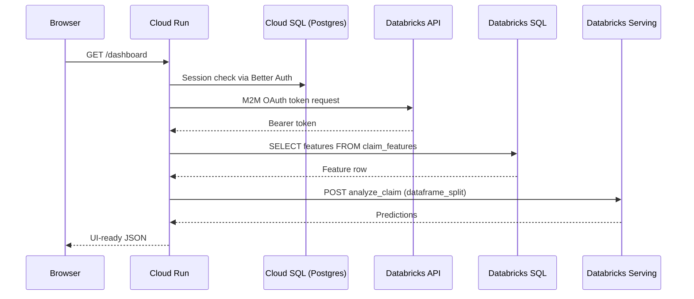

# BFF Architecture: Next.js + Better Auth + Databricks API

## Why auth moved out of Databricks-hosted frontend

Databricks Apps auth constraints made a separate web runtime the practical path for production-grade deployment. The current target is a GCP-native runtime where auth/session logic and BFF routes run in Cloud Run, while Databricks remains the system of record for data, model, and policy retrieval.

## BFF Pattern

Next.js API routes act as a Backend-for-Frontend (BFF) in Cloud Run:

```
Browser → Next.js API Route (BFF) → Databricks API
```

- The browser never holds Databricks credentials
- All Databricks calls happen server-side in Next.js route handlers
- Route handlers use a Databricks service principal (M2M OAuth client_credentials grant)
- Tokens are cached in-memory and refreshed preemptively at 50% TTL

## Why Python ML/RAG stays in Databricks

The existing ML pipeline (prediction, SHAP explanations, RAG retrieval, Vector Search) is implemented in Python using Spark, MLflow, and Databricks-specific APIs. Reimplementing in TypeScript would:

- Duplicate complex logic (feature engineering, SHAP computation, vector search)
- Lose access to the registered MLflow model (champion alias)
- Require porting the RAG pipeline (embedding model, vector index, policy chunks)

Instead, the Python logic is packaged as a Databricks Model Serving endpoint (`src/serving/claim_analysis.py`). The Next.js BFF calls this endpoint via the Databricks Serving API.

## Data flow



## Key decisions

| Decision | Rationale |
|----------|-----------|
| Better Auth (not NextAuth/Auth.js) | TypeScript-native API, explicit server/client split |
| Postgres + Drizzle (not Prisma) | Lightweight, no code generation step |
| SQL Statement Execution API (not JDBC/ODBC) | Suitable for serverless, no heavy driver |
| M2M OAuth (not PAT) | Standardized OAuth flow, easy rotation |
| Cloud SQL unix socket in Cloud Run | Avoids direct DB host exposure and matches Cloud Run integration model |

## Security boundaries

- Better Auth DB stores identity/session metadata only — no claims data
- Databricks remains system of record for claims, model, and policy data
- Real PHI requires BAA + private networking and audit controls across cloud boundaries
