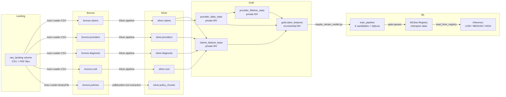

# Chapter 1: System Architecture

## 1.1 What the System Does

The **AI-Powered Claim Denial Prevention & Remediation System** is a healthcare data platform running on Databricks that ingests raw claims data, transforms it into engineered features, trains machine learning models to predict claim denials before they happen, and surfaces high-risk claims for proactive intervention.

The core workflow:

1. **Ingest** raw claims, provider, diagnosis, and cost data from flat files into Delta Lake (Bronze layer).
2. **Clean and validate** the data: normalize codes, deduplicate rows, quarantine bad records (Silver layer).
3. **Engineer 20 predictive features** with temporal rolling windows and provider risk scoring (Gold layer).
4. **Train 6 candidate models** (Logistic Regression, XGBoost, LightGBM, CatBoost, Voting Ensemble, Stacking Ensemble) with Optuna hyperparameter tuning, calibrated probabilities, and MLflow tracking.
5. **Register the best champion model** to the MLflow Model Registry under the `champion` alias, gated by strict release thresholds.
6. **Serve predictions** at inference time, classifying each claim as LOW, MEDIUM, or HIGH risk of denial.

## 1.2 Medallion Architecture

The system uses a four-layer medallion architecture: **Bronze** (raw ingest), **Silver** (trusted/cleaned), **Gold** (engineered features), and **ML** (trained models).

### Bronze Layer (`healthcare.bronze.*`)

The rawest form of the data. Files land in a managed Unity Catalog volume (`/Volumes/healthcare/bronze/raw_landing/`) and are ingested by Databricks Auto Loader with CSV format. Four Bronze tables are created:

| Table | Source | Rows | Description |
|-------|--------|------|-------------|
| `bronze.claims` | `datasets/claims_1000.csv` | 1,000 | Synthetic claim records with 13 columns including claim_id, patient_id, provider_id, diagnosis_code, billed_amount, is_denied |
| `bronze.providers` | `datasets/providers_1000.csv` | 21 | Provider reference data (doctor_name, specialty, location) |
| `bronze.diagnosis` | `datasets/diagnosis.csv` | 6 | Diagnosis code reference table (diagnosis_code, category, severity) |
| `bronze.cost` | `datasets/cost.csv` | 6 | Procedure cost benchmarks (procedure_code, average_cost, expected_cost, region) |
| `bronze.policies` | PDF files | N/A | Insurance policy documents ingested as binary files |

Each Bronze table carries Delta table properties enabling Change Data Feed (`delta.enableChangeDataFeed: true`), Deletion Vectors, and Row Tracking. PHI columns are declared in `src/common/phi_registry.py` and tracked via the `hipaa.phi_columns` table property.

### Silver Layer (`healthcare.silver.*`)

A trusted, cleaned representation of the data. The Silver pipeline reads from Bronze, then:

- **Normalizes codes** (diagnosis codes, procedure codes) against reference tables.
- **Deduplicates** claim records by `claim_id`.
- **Validates** required columns and data types; rows that fail validation are quarantined.
- **Strips sensitive columns** that are not needed downstream.
- **Written to** `healthcare.silver.*` tables with Delta CDF enabled for downstream consumption.

The architecture assumes that a full Silver snapshot is always available for Gold materialization -- Gold pipelines read Silver tables with batch reads, not streaming.

### Gold Layer (`healthcare.gold.claim_features`)

The feature-engineering layer. Implemented as four Spark DLT (Delta Live Tables) materialized views in the consolidated SDP pipeline (`services/etl/resources/etl.pipeline.yml`):

| Materialized View | Type | Purpose |
|-------------------|------|---------|
| `claims_feature_base` | Private MV | Silver claims joined with provider, diagnosis, and cost reference data. Computes 7 base features. |
| `provider_daily_stats` | Private MV | Provider/day aggregations for rolling window computations. |
| `provider_lifetime_stats` | Private MV | Provider lifetime claim counts, diagnosis counts, and risk scores. |
| `gold_claim_features` | Incremental MV | The final 20-feature output table; consumer for ML training. |

The 20 engineered features (defined in `src/ml/__init__.py`):

```
is_procedure_missing        is_amount_missing
amount_to_benchmark_ratio   billed_vs_avg_cost
high_cost_flag              severity_procedure_mismatch
specialty_diagnosis_mismatch provider_location_missing
diagnosis_severity_encoded  diagnosis_count
provider_claim_count        provider_claim_count_30d
provider_claim_count_60d    provider_claim_count_90d
provider_risk_score         cost_overbenchmark_and_highseverity
mismatch_and_overbenchmark  provider_30d_denial_rate
missing_fields_count        low_volume_provider_risk
```

These include 30d/60d/90d rolling window features, interaction features (e.g., `cost_overbenchmark_and_highseverity`), and provider risk scoring (denial rate conditioned on a minimum claim count).

### ML Layer (`healthcare.ml.claim_denial_model`)

The trained model registry in Unity Catalog. The training pipeline (`src/scripts/train_denial_model.py`, called by `src/scripts/maybe_retrain_model.py`):

1. Loads Gold features from `healthcare.gold.claim_features`.
2. Runs a **retrain gate** (`src/ml/retrain_gate.py`) that checks whether new data has arrived since the last training by comparing table fingerprints and row counts against the logged champion training metadata. If no meaningful change is detected, training is skipped entirely.
3. Trains 6 model candidates (Logistic Regression baseline, XGBoost, LightGBM, CatBoost, Voting Ensemble, Stacking Ensemble).
4. Optionally runs Optuna hyperparameter tuning (up to 200 trials) with `MedianPruner` and a custom objective that maximizes mean Recall@HIGH under a soft Precision floor of 0.70.
5. Each model is wrapped in `CalibratedClassifierCV` (Platt scaling) for calibrated probability outputs.
6. The best model is selected by sorting on `(meets_thresholds, recall_at_high, roc_auc)`.
7. If the model passes the **release gate** (see 1.7), it is logged to MLflow, registered as a new version in Unity Catalog, and the `champion` alias is moved to point at it.
8. Training metadata (gold_table_name, gold_table_version, training_data_fingerprint, feature_columns, target_column) is logged alongside the model.

## 1.3 Data Flow Diagram



## 1.4 Tech Stack

| Component | Technology |
|-----------|-----------|
| Compute Platform | Databricks on GCP (n2-highmem-2 nodes) |
| Data Processing | Apache Spark 17.3.x (ML runtime, Scala 2.13) |
| Storage Format | Delta Lake (Parquet with transaction log) |
| Data Governance | Unity Catalog (three-level namespace: `catalog.schema.table`) |
| Orchestration | SDP Lakeflow Pipelines (Bronze/Silver/Gold) + Databricks Jobs (ML/analytics) |
| ML Tracking | MLflow Tracking + MLflow Model Registry (Unity Catalog) |
| Hyperparameter Tuning | Optuna 3.6+ with MedianPruner |
| Model Libraries | XGBoost 2+, LightGBM 4.2+, CatBoost 1.2+, scikit-learn 1.5+ |
| Model Interpretation | SHAP 0.44+ |
| Class Imbalance | imbalanced-learn 0.12+ |
| Dashboard | Streamlit 1.50+ (for analytics and observability) |
| Language | Python 3.12+ |
| Package Manager | `uv` with PEP 621 `pyproject.toml` |
| Deployment | Databricks Asset Bundles (DAB) |
| CI | pre-commit hooks, pytest test suite (94+ tests) |

## 1.5 Key Design Decisions

### Unity Catalog for Governance

All tables use three-level names: `healthcare.bronze.claims`, `healthcare.silver.claims`, `healthcare.gold.claim_features`, `healthcare.ml.claim_denial_model`. The MLflow registry URI is set to `databricks-uc` when the runtime detects Databricks, ensuring models are registered as Unity Catalog objects alongside the data tables.

Six schemas are defined in `resources/schemas/schemas.yml`: `bronze`, `silver`, `quarantine`, `gold`, `analytics`, and `ml`.

### Materialized Views for Gold

The Gold pipeline uses DLT materialized views rather than batch jobs. Three private intermediate views (`claims_feature_base`, `provider_daily_stats`, `provider_lifetime_stats`) compose into the final `gold_claim_features` incremental materialized view. This design provides:

- **Automatic refresh**: incremental refresh policy means only new/changed Silver rows trigger recomputation.
- **Dependency management**: Spark DLT handles view lineage automatically.
- **Type safety**: materialized views declare schemas at definition time.

### Champion/Challenger Model Registry Pattern

The training pipeline produces 6 model candidates and selects the best one by sorting on `(meets_thresholds, recall_at_high, roc_auc)`. The winner is:

1. Logged to MLflow with all parameters, metrics, and training metadata.
2. Registered as a new version in the Unity Catalog model `healthcare.ml.claim_denial_model`.
3. The `champion` alias is moved to the new version.

Prediction callers load the model via `mlflow.sklearn.load_model("models:/healthcare.ml.claim_denial_model@champion")` -- they never depend on a run ID or local pickle path. This allows:

- **Rollback**: point `champion` back to a previous version if a new model regresses.
- **A/B testing**: deploy a `challenger` alias alongside `champion` for shadow evaluation.
- **Audit trail**: every training run produces a permanent MLflow run with full provenance.

### `experimental.skip_name_prefix_for_schema: true`

This DAB setting prevents Databricks from prepending the bundle name or target prefix to schema names. Without this flag, a schema declared as `bronze` in `resources/schemas/schemas.yml` might be created as `dev_healthcare_bronze` or similar. With the flag enabled, the schema name is used verbatim, so `healthcare.bronze` stays `healthcare.bronze` across all targets. This is essential because Python code hard-codes the schema names in table FQNs and would break with a prefixed schema.

## 1.6 HIPAA Compliance Posture

The system implements HIPAA compliance controls across several dimensions:

### PHI Column Registry (`src/common/phi_registry.py`)

Every Bronze table declares its PHI columns in a machine-readable registry. The `BronzeSource` dataclass (defined in `src/common/bronze_sources.py`) requires explicit `phi_columns: frozenset[str]` declaration, referencing 45 CFR 164.514(b)(2):

| Table | PHI Columns | Rationale |
|-------|-------------|-----------|
| `bronze.claims` | `patient_id`, `diagnosis_code`, `billed_amount`, `date`, `claim_status`, `denial_reason_code`, `allowed_amount`, `paid_amount`, `is_denied`, `follow_up_required` | Patient-identifying health information, dates, financial details |
| `bronze.providers` | None | Provider identity (doctor_name, location) is operational data, not patient health information (164.501) |
| `bronze.diagnosis` | None | Standalone diagnosis code reference table without patient linkage |
| `bronze.cost` | None | Procedure cost benchmarks are operational reference data |

The registry offers builder functions (`build_phi_columns_registry`, `build_sensitive_columns_registry`) that can project PHI declarations into any catalog/schema namespace for staging or multi-workspace deployments.

### Delta Table PHI Properties

Every Delta table carries a `hipaa.phi_columns` table property listing its PHI columns. Tables are classified as `PUBLIC` (diagnosis reference), `INTERNAL` (providers, cost), or `SENSITIVE` (claims at all layers). Gold tables are declared SENSITIVE because they join PHI-adjacent columns with engineered risk features. These properties are set via `table_properties_for_sensitivity()` in `src/common/bronze_pipeline_config.py`.

### PHI-Free Logging

Logs never interpolate PHI. The system uses `MESSAGE_TEMPLATE_*` constants with `render_*` helpers defined in `src/common/observability.py`. All messages reference identifiers (`claim_id`, `provider_id`) only -- never patient names, dates, or medical details.

### Data Classification

All Delta tables include a `hipaa.data_sensitivity` property with values `PUBLIC`, `INTERNAL`, or `SENSITIVE`, set at table creation time and propagated through the pipeline.

## 1.7 Release Gate

Before any model is pickled, registered, or deployed, it must pass the ARCHITECTURE.md Section 13 release gate. The gate enforces three thresholds on a held-out test split:

| Metric | Threshold | Description |
|--------|-----------|-------------|
| **Recall@HIGH** | >= 0.80 | Fraction of truly-denied claims whose predicted probability lands in the HIGH risk tier (>= 0.7) |
| **Precision** | >= 0.70 | Precision at the default decision threshold (0.5) |
| **ROC-AUC** | >= 0.85 | Area under the ROC curve |

These thresholds are enforced in `src/ml/evaluate.py` via `EvaluationMetrics.meets_thresholds()` at lines 49-55. If the best model fails the gate, the training script exits with code 1, the model is NOT saved to disk, and no version is registered in MLflow. This prevents underperforming models from ever being deployed.

The gate metric is **Recall@HIGH** (not global recall) -- the system measures whether truly-denied claims surface in the HIGH risk tier where remediation is actually triggered, not just that the model flagged them at any threshold. The probability threshold for HIGH risk is defined as `HIGH_RISK_PROBABILITY_THRESHOLD = 0.7` at `src/ml/evaluate.py:20` and `src/ml/predict.py:22`.
